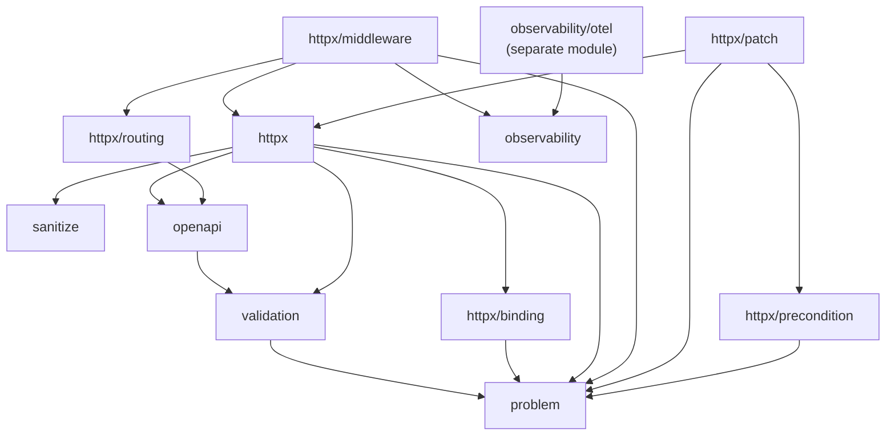

# arnon

Minimalist HTTP foundation for Go, with typed endpoints, validation,
automatic OpenAPI 3.2 generation, and errors in RFC 9457 (Problem
Details) format.

Read first, in this order:

1. [docs/architecture/project-context.md](docs/architecture/project-context.md) —
   the project's functional/architectural spec and current state, including the
   rationale behind the rules below.
2. [docs/coding-style.md](docs/coding-style.md) — code conventions
   (formatting, error handling/wrapcheck, explicit dependencies).
3. [CONTRIBUTING.md](CONTRIBUTING.md) — branch workflow (rebase) and
   commit convention (Conventional Commits, in English, imperative
   mood), mandatory on `main`. A work branch that will be squashed on
   merge doesn't need to follow it strictly for its intermediate
   history.

Package-scoped rules live in a `CLAUDE.md` next to the code they describe —
`httpx/`, `httpx/middleware/`, `httpx/patch/`, `httpx/precondition/`,
`examples/`. Claude Code loads those on demand when it reads files in those
directories; other agents should read the one matching whatever they're
editing.

## Commands

`make help` lists everything. The main ones:

```sh
make test          # go test ./... in each library module
make test-race     # with the race detector
make coverage      # generates coverage.html (profiles of all modules merged)
make lint          # golangci-lint v2, version pinned in the Makefile
make lint-md       # markdownlint-cli2, requires Node.js >= 20
make verify-docs   # compiles the Go programs embedded in the Markdown
make doc-sync      # lists docs an exported-API change left behind
make arch-lint     # go-arch-lint check
make test-mutation # gremlins, writes mutation.json
make check         # lint + arch-lint + test-race (minimum before a commit)
make run           # go run ./examples/cmd/basic (or: make run EXAMPLE=name)
```

**This repository is three modules** (`.`, `observability/otel`, `examples`),
tied together by a committed `go.work` — see
[docs/architecture/adr-0001-module-layout.md](docs/architecture/adr-0001-module-layout.md)
for why, and for the ordered release procedure the split imposes. Practical
consequence for any target you add: neither `go test ./...` nor
`golangci-lint` crosses a module boundary, not even inside a workspace, so
per-module targets must iterate `$(MODULES)`/`$(LIB_MODULES)` rather than rely
on `./...`. `arch-lint` is the one exception — `go-arch-lint` resolves
components from the filesystem, so a single run from the root still covers all
three.

Tooling traps that cost time when rediscovered:

* `golangci-lint` needs v2 (`.golangci.yml` uses `version: "2"`); v1 fails to
  load the config. The Makefile pins golangci-lint/go-arch-lint/gremlins via
  `go run pkg@version`, so no global install is needed.
* **`gremlins` doesn't handle Go's `./...` pattern** — it silently reports "No
  results to report" for multiple packages. The Makefile passes `.` instead
  (gremlins recurses through the module on its own). Don't switch back to
  `./...` thinking it's equivalent.
* `make lint-md` needs **Node.js >= 20**, not just "a" Node: `markdownlint-cli2`'s
  own dependencies use syntax older runtimes reject outright (confirmed
  empirically, it isn't a version warning). It's the one non-Go tool here, since
  no Go implementation matches markdownlint's rule fidelity.
  `.markdownlint.json` is auto-discovered by both the Makefile target and CI's
  `markdownlint-cli2-action`; no explicit `config:` input is needed. `NOTES.md`
  is excluded in the Makefile target only, since it's gitignored and absent from
  any CI checkout.
* `MD060` (table-column-style) is off in `.markdownlint.json`, same reasoning as
  `MD013`'s `"tables": false`: this project's tables have cells running hundreds
  of characters, so hand-aligned pipes don't survive the next edit and
  `--fix` can't repair them. Don't turn it back on.

## Package dependency graph

Documented and enforced by `.go-arch-lint.yml`. Arrow direction =
"may depend on":



The graph is strictly layered: nothing depends upward. `routing` registers
OpenAPI operations through `routing.OpenAPIProvider`, an interface declared in
`routing` itself — a handler satisfies it structurally, so `httpx` never has to
know the router exists.

`observability/otel` and `examples` are **separate modules**, so their edges
cross a module boundary — but `.go-arch-lint.yml` still describes and enforces
them, since `go-arch-lint` works on the filesystem. What the boundary changes is
that `observability/otel` may never import anything from the root module other
than `observability`: a new edge out of it turns an ordinary import into a new
inter-module dependency.

Before adding an import between internal packages, run `go-arch-lint check` —
it fails the build if the edge isn't allowed.

## Non-obvious decisions

Package-specific rules moved to the per-directory files listed at the top. What
stays here is what applies before you open any particular package.

* **Global middleware (`Router.Use`) wraps the entire `mux` in `ServeHTTP`, not
  each route individually.** This is what makes pre-routing middleware
  (`StripSlashes`) work, and what makes 404s pass through
  `RequestID`/`Logging`/etc. Group middleware (`Group.Use`) is still applied
  per-route in `router.register`, since `net/http.ServeMux` has no notion of a
  prefix. Don't merge `router.middlewares` back into `register()` — that would
  duplicate execution.
* **No global variables besides deliberate singletons** (`validation.Default()`,
  the custom rule registry, the sanitize registry). Prefer explicit dependency
  injection for everything else, per `docs/coding-style.md`.
* **Custom validators go through a single registry
  (`validation.RegisterCustomRule`)**, not direct configuration of the
  underlying `*validatorv10.Validate`. One registration feeds runtime, error
  mapping and OpenAPI schema generation at once — don't add a parallel
  mechanism for registering custom tags without wiring all three places
  (`validation/playground.go`, `validation/mapper.go`, `openapi/validation.go`).
* **`sanitize` runs between binding and validation in `httpx.Endpoint`, and is
  its own package, not part of `validation`.** A sanitizer is a pure
  `func(string) string` with no error path and no OpenAPI surface — trimming
  doesn't change the wire contract, only what the server does with the value —
  so `sanitize` depends on nothing internal, not even `problem`. `RegisterFunc`
  mirrors `RegisterCustomRule`'s single-registry pattern; `sanitize:"trim,email"`
  chains named transforms. A struct field is always recursed into (matching
  `validator/v10`'s automatic dive); a slice/array/map field needs its tag to
  start with `dive`. See project-context.md's "Sanitization" section for the
  walker design, including why `Prepare` walks the `reflect.Type` rather than a
  live value.
* **`openapi/reflection_field.go` gives the explicit `format` tag priority**
  over what `applyValidationTags` inferred, which in turn beats the
  `inferFormatFromValidator` fallback. That order is intentional (the same tag
  can be recognized in both places) — don't reverse it.

## Documentation synchronization

Any change to an exported function, an exported config/request/response struct
(e.g. `EndpointConfig`, `RateLimitConfig`, `CORSConfig`, `openapi.Operation`),
or a `Router`/`Group` routing method (`GET`, `POST`, `Use`, `Handle`, etc.) is
not done until every place that shows that API in code has been checked and, if
needed, updated:

Part of this is now enforced. `make check` runs `verify-docs`, which compiles
every self-contained `package main` block in the Markdown (today: the Quick
start in both READMEs) against the working tree, and `make test` runs the
`Example` functions in each package's `example_test.go` — those compile *and*
assert their own output, so a changed status code or JSON shape fails the build.
**Prefer adding an `Example` over prose**: it's the only documentation the
toolchain can keep honest, and it shows up on pkg.go.dev.

What is still on you:

* [skills/using-arnon/SKILL.md](skills/using-arnon/SKILL.md) — its snippets are
  illustrative fragments, so `verify-docs` reports them as unverifiable. They
  must still match the current API, not just parse as Go.
* `examples/cmd/*` — a signature change that breaks compilation is already
  caught by `go build ./...`; one that still compiles (a new optional field, a
  widened type, a renamed but still-valid parameter) is not, and can leave an
  example silently demonstrating a stale pattern.
* The prose *around* the verified snippets in `README.md` / `README.pt-BR.md` —
  the code is checked, the sentences describing it aren't. Keep the two in sync.
* [docs/architecture/project-context.md](docs/architecture/project-context.md)
  and its `.pt-BR` twin — the code snippets and the prose describing the changed
  behavior.
* This file, the per-directory `CLAUDE.md` covering the package you changed, and
  the dependency graph above if the change adds or removes an import.

`make doc-sync` prints which of the above a diff touching the exported surface
has not touched. It never fails: a change can legitimately leave all of them
alone, and a check that cried wolf would be ignored. A `Stop` hook in
`.claude/settings.json` surfaces the same output at the end of a turn.

For a closer look, the `api-surface-reviewer` subagent
(`.claude/agents/`) reads the diff in a clean context and reports what changed
in the exported API with `file:line`, and which documentation contradicts it.

Treat updating these as part of the same change, not a follow-up — a stale code
example is a bug in the documentation.
