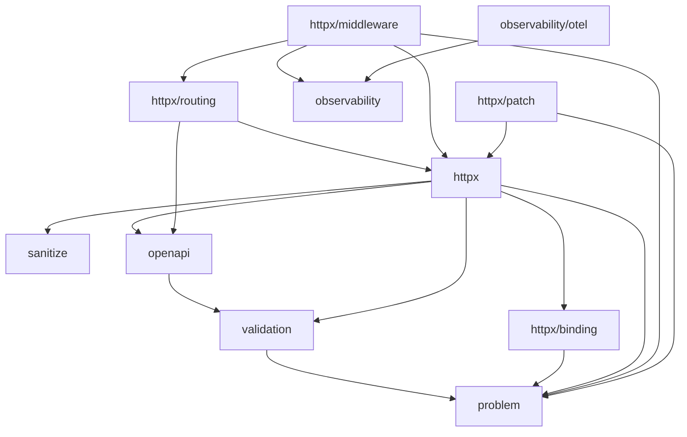

# arnon

Minimalist HTTP foundation for Go, with typed endpoints, validation,
automatic OpenAPI 3.2 generation, and errors in RFC 9457 (Problem
Details) format.

Read first, in this order:

1. [docs/architecture/project-context.md](docs/architecture/project-context.md) —
   the project's functional/architectural spec and current state.
2. [docs/coding-style.md](docs/coding-style.md) — code conventions
   (formatting, error handling/wrapcheck, explicit dependencies).
3. [CONTRIBUTING.md](CONTRIBUTING.md) — branch workflow (rebase) and
   commit convention (Conventional Commits, in English, imperative
   mood), mandatory on `main`. A work branch that will be squashed on
   merge doesn't need to follow it strictly for its intermediate
   history.

## Commands

`make help` lists everything. The main ones:

```sh
make test          # go test ./...
make test-race     # with the race detector
make coverage      # generates coverage.html
make lint          # golangci-lint v2, version pinned in the Makefile
make lint-md       # markdownlint-cli2, requires Node.js >= 20
make arch-lint     # go-arch-lint check
make test-mutation # gremlins, writes mutation.json
make check         # lint + arch-lint + test-race (minimum before a commit)
make run           # go run ./examples/cmd/basic (or: make run EXAMPLE=name)
```

`golangci-lint` needs v2 (`.golangci.yml` uses `version: "2"`); v1
fails to load the config. The Makefile already uses a pinned
`go run pkg@version` for golangci-lint/go-arch-lint/gremlins, with no
global install required.

`gremlins` (mutation testing) doesn't handle Go's `./...` pattern —
it silently reports "No results to report" for multiple packages. The
Makefile already works around this by passing `.` (it recurses through
the whole module on its own); don't switch back to `./...` thinking
it's equivalent.

`make lint-md` is the one non-Go tool here (no Go implementation
matches markdownlint's rule fidelity), run via `npx` — no `go run`
pinning available for it, so it needs Node.js >= 20 locally (not just
"a" Node — `markdownlint-cli2`'s own dependencies use syntax older
runtimes reject outright, not just a version warning, confirmed
empirically). `.markdownlint.json` is picked up automatically by both
`make lint-md` and CI's `markdownlint-cli2-action`
(`.github/workflows/ci.yml`) — markdownlint-cli2 auto-discovers it,
no explicit `config:` input needed. `NOTES.md` (gitignored, so absent
in any CI checkout) is excluded explicitly in the Makefile target
only, since it's a local working file never meant to be lint-clean.

`MD060` (table-column-style, requires pipes to be consistently
aligned/padded within a table) is disabled entirely in
`.markdownlint.json`, same reasoning as `MD013`'s existing
`"tables": false` — this project's tables (the framework comparison
table in particular) have cells running hundreds of characters, so
hand-aligning pipe columns is impractical and doesn't survive the next
edit (confirmed: the README package table had already drifted out of
alignment before this rule was even added to the config, from edits
made across this project's own history). `markdownlint-cli2 --fix`
can't repair "aligned"-style violations on its own either — verified
directly, it left the table unchanged and still reported all 23
errors — confirming this isn't a fixable formatting slip, it's a rule
that doesn't fit this kind of table.

## Package dependency graph

Documented and enforced by `.go-arch-lint.yml`. Arrow direction =
"may depend on":



`httpx/routing` is the only "bottom-up" edge in the graph: routing
depends on `httpx` because of the `httpx.OpenAPIProvider` interface.

Before adding an import between internal packages, run
`go-arch-lint check` — it fails the build if the edge isn't allowed in
`.go-arch-lint.yml`.

## Non-obvious decisions

* **Global middleware (`Router.Use`) wraps the entire `mux` in
  `ServeHTTP`, not each route individually.** This is what makes
  pre-routing middleware (`StripSlashes`) work, and what makes 404s
  pass through `RequestID`/`Logging`/etc. Group middleware
  (`Group.Use`) is still applied per-route in `router.register`, since
  `net/http.ServeMux` has no notion of a prefix. Don't merge
  `router.middlewares` back into `register()` — that would duplicate
  execution.
* **The relative order of global middleware matters, and
  `middleware.BuildChain` is how that's guaranteed by code, not
  discipline.** `httpx/middleware/chain.go`:
  `BuildChain(ChainConfig{...})` always assembles the recommended
  chain (`Recover` → `Timeout` → `StripSlashes`/`RedirectSlashes` →
  `RealIP` → `RequestID` → `SecureHeaders` → `RateLimit`/`Throttle` →
  `ETag` → `Compress` → `CORS` → `ServiceDesc` → `Logging`) in the
  same relative order, actually tested in
  `httpx/middleware/chain_test.go` (observable behavior, not just
  docs). Full detail on why each position exists in
  `docs/architecture/project-context.md`, "Middleware order" section —
  don't duplicate that explanation here, just the pointer. A chain
  assembled by hand with `router.Use(mw1, mw2, ...)` is still the
  caller's responsibility; there's no static validation for that
  (`routing.Middleware` is just `func(http.Handler) http.Handler`,
  with no identity of its own at runtime) — that's exactly why
  `BuildChain` exists. `AllowContentType`/`MaxBodyBytes`/`NoCache` are
  deliberately left out: they're group middleware, not global.
* **Custom middleware with an ordering requirement uses
  `ChainConfig.Extra` (`ChainAnchor` + `ExtraMiddleware`), not a
  second parallel API.** Every position in `BuildChain` has an
  `AnchorXxx` constant; `ExtraMiddleware{Middleware: ..., Before:
  AnchorY}` or `{..., After: AnchorY}` inserts there. `BuildChain`
  validates (panics if invalid) that each entry sets exactly one of
  Before/After and that the anchor is a known constant — a typo should
  never silently drop the middleware. Equivalent alternative without
  `Extra`: split the `BuildChain` call in two (`Router.Use`
  accumulates across calls). When adding a new global middleware: it
  needs a field in `ChainConfig` **and** a `ChainAnchor` (with an entry
  in `validChainAnchors`) **and** an `appendStage(...)` call in the
  right place — all three, or it becomes unreachable via
  `BuildChain`/`Extra` and the order doc in `project-context.md` goes
  stale.
* **RFC 9457 is the only error format.** Every HTTP error becomes a
  `problem.Problem`. `httpx.WriteProblem`/`httpx.WriteJSON` always
  encode the response into a buffer before writing any header — don't
  reverse that order, it's what prevents a corrupted response when
  serialization fails.
* **`Endpoint()` always calls `EndpointConfig.WithDefaults()`.** Don't
  reintroduce the `if config.Validator != nil` / `if
  config.ProblemMapper != nil` checks that used to exist — after
  `WithDefaults()`, those fields are never nil.
* **OpenAPI registration is opt-in per endpoint.** A route only shows
  up in the generated document if `EndpointConfig.OpenAPI` is set
  (even to an empty `&openapi.Operation{}`).
* **`EndpointConfig.SuccessStatus` and `openapi.Operation.SuccessStatus`
  are independent fields.** Nothing syncs the two today; when you
  change one, check the other (see `examples/cmd/basic/main.go`).
* **`examples/` follows the `cmd/`+`internal/` pattern.** Each
  runnable example lives in `examples/cmd/<name>` (`basic`: typed
  endpoint + validation + OpenAPI, zero middleware; `middleware`: the
  same endpoint with the full middleware stack; `observability`: the
  same endpoint with tracing/metrics via OpenTelemetry; `files`: file
  download/upload as plain `http.Handler`s; `staticfiles`:
  `http.FileServer` with `ETag`/`Compress` applied globally;
  `patch`: `PATCH` derived from `GET`+`PUT` via `httpx/patch.From`).
  Code shared between them (logger, custom validator registration, the example
  handler) lives in `examples/internal/*` — not importable from
  outside `examples/` per Go's own rule, which is also why `examples`
  had to be added to its own `mayDependOn` in `.go-arch-lint.yml`
  (otherwise the `cmd/* -> internal/*` cross-import is blocked even
  though both sides are the same component). New example: create
  `examples/cmd/<name>`, reuse what already exists in
  `examples/internal`, only duplicate what's specific to that example.
* **`examples/cmd/observability` needs graceful shutdown to make
  sense.** It's the only one of the three examples that handles
  `SIGINT`/`SIGTERM` explicitly (`signal.NotifyContext` +
  `server.Shutdown` + the shutdown function `otel.Initialize`
  returns) — without it, spans and metrics still sitting in the SDK's
  buffer (the trace batch processor, the metric periodic reader) are
  lost when the process dies. `otel.Initialize` only returns an
  OTLP/gRPC exporter (no stdout option), so the example spins up a
  local OTel Collector via `docker compose` with the `debug` exporter
  (prints every trace/metric it receives to the collector's own log) —
  actually validated by running the collector, matching the exported
  trace_id/span_id against what the application logged, and checking
  the custom metrics' exemplars pointing at the exact trace.
* **`middleware.Logging` only correlates trace_id/span_id if
  registered after `routing.WithInstrumentation`.** `router.register`
  applies `instrumentHandler` (which creates the span) on top of
  group/route middleware, but only *inside* the mux's dispatch — a
  *global* middleware (`router.Use`) runs before that dispatch.
  `Logging` builds its attributes (including
  `observability.TraceID`/`SpanID`) before calling `next`, so if it's
  global, the context doesn't have a span yet. That's why
  `examples/cmd/observability` registers `Logging` via `api.Use(...)`
  (group), not `router.Use(...)`.
* **Custom validators go through a single registry
  (`validation.RegisterCustomRule`)**, not direct configuration of the
  underlying `*validatorv10.Validate`. One registration feeds runtime,
  error mapping, and OpenAPI schema generation at the same time — don't
  add a new parallel mechanism for registering custom tags without
  wiring into all three places (`validation/playground.go`,
  `validation/mapper.go`, `openapi/validation.go`).
* **`sanitize` runs between binding and validation in `httpx.Endpoint`,
  and is its own package, not part of `validation`.** A sanitizer is a
  pure `func(string) string` with no error path and no OpenAPI
  surface — trimming/normalizing doesn't change the wire contract,
  only what the server does with the value — so `sanitize` depends on
  nothing internal, not even `problem`. `RegisterFunc` mirrors
  `validation.RegisterCustomRule`'s single-registry pattern; the
  `sanitize:"trim,lower"` tag chains named transforms. A struct field
  is always recursed into (matches `validator/v10`'s own automatic
  dive into a nested struct); a slice/array/map field needs its tag to
  start with `dive`, matching `validate`'s own convention — see
  `docs/architecture/project-context.md`'s "Sanitization" section for
  the full walker design, including why `Prepare` walks the
  `reflect.Type` rather than a live value (so a typo'd tag behind a
  nil pointer field still fails at `Endpoint` construction instead of
  silently doing nothing on the one request that happens to populate
  it). Deliberately has no fuego-style "Output Transformation"
  counterpart: the handler already has full write access to the
  response before `Endpoint` serializes it, so masking or computing a
  field there is just Go code — no framework hook is missing.
* **`openapi/reflection_field.go` gives the explicit `format` tag
  priority** over what `applyValidationTags` already inferred, which
  in turn takes priority over the `inferFormatFromValidator` fallback.
  That order is intentional (the same tag can be recognized in both
  places) — don't reverse it.
* **No global variables besides deliberate singletons**
  (`validation.Default()`, the custom rule registry, the sanitize
  registry). Prefer explicit dependency injection for everything else,
  per `docs/coding-style.md`.
* **Binding errors don't carry an HTTP status by default — but can
  override it.** `httpx.Endpoint` (`writeValidationProblem`) defaults
  to 400 for any `binding.Decode` error, *except* when a
  `problem.ValidationError.Code` has `StatusOverride() != 0`
  (`problem/validation_code.go`) — today only
  `ValidationCodePayloadTooLarge` → 413. This is how `MaxBodyBytes`
  manages to return 413 even when the body overflows mid-read
  (chunked, unknown size), without changing `binding.Decode`'s
  signature. New code that should imply a status other than 400: add
  the case to `StatusOverride()`, don't invent another parallel
  mechanism.
* **`RateLimit` uses a sliding-window counter (2 windows), not a
  per-key limiter with no eviction.** Adapted from `go-chi/httprate`,
  implemented from scratch in `httpx/middleware/rate_limit.go` with no
  external dependency (just `sync`/`time`). Old windows are discarded
  in bulk as time advances, so inactive keys are automatically removed
  within at most two windows — don't reintroduce the
  `golang.org/x/time/rate` + `sync.Map`-with-no-eviction version that
  briefly existed here, it had unbounded memory growth.
* **`RateLimit` separates the algorithm (sliding window) from storage
  via the `LimitCounter` interface.** Deliberately mirrors
  `go-chi/httprate`'s own `LimitCounter` interface, so a backend
  already written for httprate (e.g. `go-chi/httprate-redis`) needs
  only trivial changes to serve arnon too, and vice versa. A nil
  `RateLimitConfig.Counter` uses the in-memory default
  (`NewLocalLimitCounter`, exported — correct only for a single
  instance). External backends (Redis, Valkey, Memcached, ...) should
  be separate Go modules, never a dependency of the `arnon` module
  itself — that's why only the interface + docs are included here,
  with no external backend implementation. A `Counter` error becomes a
  `problem.Problem` via `RateLimitConfig.OnCounterError` (default: 503
  Service Unavailable, configurable). Don't reintroduce a second
  storage mechanism parallel to `LimitCounter`.
* **`httpx.WriteProblem` takes `*http.Request` and auto-populates
  `Problem.Instance`.** If `Instance` is empty, it's filled with
  `request.URL.Path` before serializing (never overwriting a value
  already set via `.WithInstance(...)`). `request_id`/`trace_id` can't
  be used here instead of the path because `httpx` can't depend on
  `httpx/middleware`/`observability` in the `.go-arch-lint.yml` graph —
  whoever wants that calls `.WithInstance(...)` in their own
  `ProblemMapper`. Every internal call site of `WriteProblem` passes
  `request`; a new call site can't forget that parameter.
* **`ETag` buffers the entire response before deciding 200 or 304.**
  Unlike `Compress` (which can stream via `gzip.Writer`), hashing the
  body requires the complete body first — that's why
  `httpx/middleware/etag.go` uses the same "buffer everything, decide
  at the end" pattern `Timeout` already uses. Only acts on `GET`/`HEAD`
  and only on 2xx responses. Body suppression for `HEAD` and
  `Content-Length` calculation happen at the connection layer of
  `net/http.Server`, *below* any middleware `ResponseWriter` — so
  `ETag` doesn't need (and shouldn't) special-case `HEAD`, the buffer
  already sees the full body either way (confirmed empirically, not
  assumed, while designing this middleware). If used with `Compress`,
  install `ETag` first (more outer), to hash the already-compressed
  bytes — consistent with the `Vary: Accept-Encoding` `Compress`
  already sets.
* **`ETag` and `Compress` both step aside for any request carrying a
  `Range` header**, running `next` unwrapped instead of buffering/
  transforming it. This is what makes it safe to put either in front
  of a Range-capable handler (`http.FileServer`, `http.ServeContent`,
  or anything else serving resumable downloads/media seeking) —
  confirmed empirically, not assumed, by running `examples/cmd/
  staticfiles` with both applied globally and inspecting the actual
  response headers/bytes for a plain GET versus a Range GET (see the
  doc comments on `middleware.ETag`/`middleware.Compress` for the
  mechanism: without this, `ETag` breaks `If-Range` and produces a
  validator that isn't stable across full vs. partial requests for the
  same resource; `Compress` leaves `Content-Range` describing the
  pre-compression byte positions while shipping a compressed body of a
  different length). A Range GET simply gets neither — only the
  underlying handler's own Range/conditional-GET handling — while a
  plain GET to the same route still benefits from both. No route
  scoping needed for this specific concern; `Group.Use` (as used for
  `AllowContentType`/`MaxBodyBytes` in `examples/cmd/middleware`) is
  still how you'd scope either for unrelated reasons.
* **`CORS` only intercepts `OPTIONS` when it's a genuine preflight.**
  The condition is `request.Method == http.MethodOptions &&
  request.Header.Get("Access-Control-Request-Method") != ""` — that's
  the exact definition of a "CORS-preflight request" in the Fetch spec
  §4.1. An `OPTIONS` without that header falls through to
  `next.ServeHTTP`, reaching the `mux`, which returns a real
  `405`+`Allow` (reflecting the methods actually registered for that
  path) or triggers an explicit user `OPTIONS` handler, if any. Don't
  go back to intercepting every `OPTIONS` unconditionally — that
  masked the `ServeMux`'s real `Allow` and made an explicit
  `Router.OPTIONS(...)` unreachable.
* **`RealIP` checks `Forwarded` (RFC 7239) before
  `X-Forwarded-For`/`X-Real-IP`/`RemoteAddr`.** `Forwarded` is the
  IETF-standardized replacement; the other two remain as fallbacks in
  the same order as before. `parseForwardedFor`
  (`httpx/middleware/real_ip.go`) only uses the first hop (same
  "leftmost = original client" logic as `X-Forwarded-For`), treats
  `for=unknown` as "no information" (falls through to the next
  header), and keeps an obfuscated identifier (`for=_something`) as-is,
  since it still works as a stable rate-limit key even though it isn't
  an IP.
* **`httpx.Endpoint` is JSON-only by design, but `Router` isn't.**
  `Endpoint()` always checks `Accept` (`httpx/accept.go`,
  `acceptsJSON`) and returns `406` if the client explicitly excludes
  `application/json` — but that doesn't turn into negotiation between
  multiple representations (JSON vs. XML vs. whatever) for the same
  endpoint, and it shouldn't: whoever needs to return XML, PDF, or any
  other format/file mounts a plain `http.Handler` via
  `Router.GET`/`POST`/etc., just like any other route — no middleware
  in the framework is coupled to JSON (`Compress`, `ETag`, etc. work
  with any `Content-Type`). Don't invent a second typed-endpoint
  abstraction for a "non-JSON endpoint": the existing pattern already
  is to use a plain `http.Handler` for that case.
* **Header binding (`[]string`) treats multiple lines and a single
  comma-separated value as equivalent.** RFC 9110 §5.3 says the two
  forms are semantically the same for headers, so
  `httpx/binding/header.go` (`headerValues`) merges the two. Query
  binding (`[]string`) only collects a repeated key
  (`?tag=a&tag=b`), it does **not** split on commas — there's no RFC
  defining that semantics for query strings, and splitting arbitrarily
  would break a legitimate search value like `?q=cats,dogs`. Don't
  unify the two behaviors.
* **`Compress`/`Endpoint` do real parsing of `Accept-Encoding`/`Accept`,
  not `strings.Contains`.** Both need to decide "does the client
  accept X" while accounting for the `q` parameter (RFC 9110
  §12.5.1/§12.5.3) — an explicit `q=0` means refusal, something a
  plain `strings.Contains(header, "gzip")` (`Compress`'s old approach)
  couldn't see. Any new code that needs to check a content-negotiation
  header should follow this pattern (parse `;q=`, find the most
  specific match), not go back to a substring check.
* **`httpx/patch.From` derives `PATCH` from `GET`+`PUT` by request
  replay, not by teaching `httpx.Endpoint` anything about partial
  updates.** It calls the given `get`/`put` `http.Handler`s directly —
  never through a `Router` — because replaying through
  `Router.ServeHTTP` would re-run global middleware (`RequestID`,
  `RateLimit`, `Logging`, ...) a second time for the synthetic
  request. `request.Clone` is what makes this safe: confirmed against
  Go's stdlib source that `Clone` explicitly copies the internal
  `matches`/`otherValues` fields `PathValue` reads (fixed for exactly
  this reuse-across-calls scenario, issue 61410), so the internal
  `GET`/`PUT` still resolve path parameters correctly without any
  extra wiring.
  Unlike huma's `autopatch.AutoPatch(api)`, this doesn't
  auto-discover the `GET`/`PUT` pair for a path — `openapi.Generator`/
  `Registry` is write-only (`Register`/`RegisterTypes`, no lookup) and
  only tracks endpoints that opted into OpenAPI, so repurposing it as
  a functional routing registry would be a layering violation.
  Explicit `get`/`put` arguments avoid that, and match the framework's
  existing "explicit over magic" pattern (`ChainConfig.Extra` over
  auto-ordering, `CORS` not intercepting every `OPTIONS`).
  The internal `GET`→apply→`PUT` sequence has an accepted lost-update
  race under concurrent `PATCH`es to the same resource: `arnon` has no
  `If-Match`/optimistic-concurrency mechanism yet (see the 428/
  `If-Match` note above), so nothing rejects the internal `PUT` if the
  resource changed in between. `From` still copies the internal
  `GET` response's `ETag`/`Last-Modified` onto the internal `PUT`'s
  `If-Match`/`If-Unmodified-Since` (mirroring huma) — inert today, but
  means `From` won't need rework once that mechanism exists. This
  trade-off was a deliberate, explicit choice, not an oversight — don't
  "fix" the race without also landing `If-Match` support first.

## Documentation synchronization

Any change to an exported function, an exported config/request/
response struct (e.g. `EndpointConfig`, `RateLimitConfig`,
`CORSConfig`, `openapi.Operation`), or a `Router`/`Group` routing
method (`GET`, `POST`, `Use`, `Handle`, etc.) is not done until every
place that shows that API in code has been checked and, if needed,
updated:

* [skills/using-arnon/SKILL.md](skills/using-arnon/SKILL.md) — every
  code snippet there must still match the current API, not just still
  parse as Go.
* `examples/cmd/*` — the runnable examples. A signature change that
  breaks compilation is already caught by `go build ./...`; one that
  still compiles (a new optional field, a widened type, a renamed but
  still-valid parameter) is not, and can leave an example silently
  demonstrating a stale pattern.
* `README.md` and `README.pt-BR.md` — both contain a full working
  "Quick start" example; keep the two in sync with each other and with
  the real API.
* [docs/architecture/project-context.md](docs/architecture/project-context.md) —
  its code snippets and the prose describing the changed behavior.
* This file — the "Non-obvious decisions" bullet(s) referencing the
  changed symbol, and the dependency graph if the change adds or
  removes an import between packages.

`make check` (lint + arch-lint + tests) does not verify any of this:
it confirms the code itself is correct, not that the documentation
still describes it accurately. Treat updating these as part of the
same change, not a follow-up task — a stale code example is a bug in
the documentation, and it should be fixed with the same care as one in
the code.
