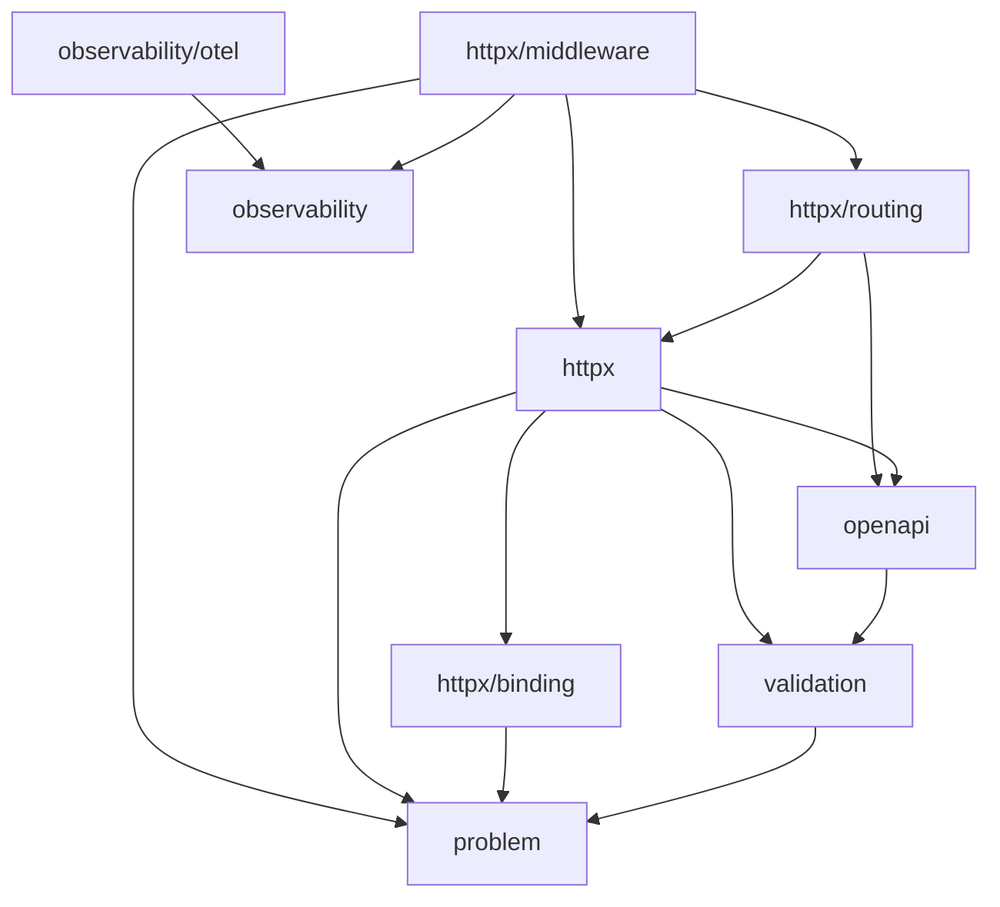

# arnon

Fundação HTTP minimalista para Go, com endpoint tipado, validação, geração
automática de OpenAPI 3.2 e erros no formato RFC 9457 (Problem Details).

Leia primeiro, nesta ordem:

1. [docs/architecture/project-context.md](docs/architecture/project-context.md) —
   especificação funcional/arquitetural e estado atual do projeto.
2. [docs/coding-style.md](docs/coding-style.md) — convenções de código
   (formatação, tratamento de erro/wrapcheck, dependências explícitas).
3. [CONTRIBUTING.md](CONTRIBUTING.md) — fluxo de branch (rebase) e
   convenção de commit (Conventional Commits, em inglês, modo
   imperativo), obrigatória em `main`. Numa branch de trabalho que vai
   passar por squash ao ser mesclada, o histórico intermediário não
   precisa seguir à risca.

## Comandos

`make help` lista tudo. Os principais:

```sh
make test          # go test ./...
make test-race     # com detector de race conditions
make coverage      # gera coverage.html
make lint          # golangci-lint v2, versão fixa no Makefile
make arch-lint     # go-arch-lint check
make test-mutation # gremlins, grava mutation.json
make check         # lint + arch-lint + test-race (mínimo antes de commit)
make run           # go run ./examples/cmd/basic (outro: make run EXAMPLE=nome)
```

`golangci-lint` precisa da v2 (`.golangci.yml` usa `version: "2"`); a v1
falha ao carregar o config. O Makefile já usa `go run pkg@versão` fixa
para golangci-lint/go-arch-lint/gremlins, sem exigir instalação global.

`gremlins` (mutation testing) não lida com o padrão `./...` do Go —
silenciosamente reporta "No results to report" para múltiplos pacotes.
O Makefile já contorna isso passando `.` (ele recursa sozinho no módulo
inteiro); não troque para `./...` achando que é equivalente.

## Grafo de dependências entre pacotes

Documentado e verificado por `.go-arch-lint.yml`. Direção das setas =
"pode depender de":



`httpx/routing` é a única aresta "de baixo pra cima" do grafo: routing
depende de `httpx` por causa da interface `httpx.OpenAPIProvider`.

Antes de adicionar um import entre pacotes internos, rode
`go-arch-lint check` — ele falha o build se a aresta não estiver
permitida em `.go-arch-lint.yml`.

## Decisões não óbvias

* **Middleware global (`Router.Use`) envolve o `mux` inteiro em
  `ServeHTTP`, não cada rota individualmente.** É o que faz middleware
  pré-roteamento (`StripSlashes`) funcionar e faz 404s passarem por
  `RequestID`/`Logging`/etc. Middleware de grupo (`Group.Use`) continua
  aplicado por-rota em `router.register`, já que `net/http.ServeMux`
  não tem noção de prefixo. Não volte a mesclar `router.middlewares`
  dentro de `register()` — duplicaria a execução.
* **A ordem relativa das middlewares globais importa, e
  `middleware.BuildChain` é o jeito de garantir isso por código, não
  por disciplina.** `httpx/middleware/chain.go`:
  `BuildChain(ChainConfig{...})` monta a cadeia recomendada
  (`Recover` → `Timeout` → `StripSlashes`/`RedirectSlashes` → `RealIP`
  → `RequestID` → `SecureHeaders` → `RateLimit`/`Throttle` → `ETag` →
  `Compress` → `CORS` → `ServiceDesc` → `Logging`) sempre na mesma
  ordem relativa, testado de verdade em
  `httpx/middleware/chain_test.go` (comportamento observável, não só
  doc). Detalhe completo do porquê de cada posição em
  `docs/architecture/project-context.md`, seção "Ordem dos
  middlewares" — não duplique essa explicação aqui, só o ponteiro. Uma
  cadeia montada manualmente com `router.Use(mw1, mw2, ...)` continua
  sendo responsabilidade de quem escreve; não existe validação
  estática pra isso (`routing.Middleware` é só
  `func(http.Handler) http.Handler`, sem identidade própria em
  runtime) — é exatamente por isso que `BuildChain` existe.
  `AllowContentType`/`MaxBodyBytes`/`NoCache` ficam de fora de
  propósito: são middlewares de grupo, não globais.
* **Middleware customizada com requisito de ordem usa
  `ChainConfig.Extra` (`ChainAnchor` + `ExtraMiddleware`), não uma
  segunda API paralela.** Cada posição do `BuildChain` tem uma
  constante `AnchorXxx`; `ExtraMiddleware{Middleware: ..., Before:
  AnchorY}` ou `{..., After: AnchorY}` insere ali. `BuildChain` valida
  (panic se não validar) que cada entrada seta exatamente um de
  Before/After e que a âncora é uma constante conhecida — um typo
  nunca deve descartar a middleware em silêncio. Alternativa
  equivalente sem `Extra`: dividir a chamada de `BuildChain` em duas
  (`Router.Use` acumula entre chamadas). Ao adicionar uma middleware
  global nova: precisa de campo em `ChainConfig` **e** `ChainAnchor`
  (com entrada em `validChainAnchors`) **e** chamada
  `appendStage(...)` no lugar certo — as três coisas, ou ela fica de
  fora do `BuildChain`/`Extra` e a doc de ordem em
  `project-context.md` fica desatualizada.
* **RFC 9457 é o único formato de erro.** Todo erro HTTP vira
  `problem.Problem`. `httpx.WriteProblem`/`httpx.WriteJSON` sempre
  codificam a resposta num buffer antes de escrever qualquer header —
  não inverta essa ordem, é o que evita corromper a resposta quando a
  serialização falha.
* **`Endpoint()` sempre chama `EndpointConfig.WithDefaults()`.** Não
  reintroduza os `if config.Validator != nil` / `if config.ProblemMapper
  != nil` que existiam antes — depois de `WithDefaults()`, esses campos
  nunca são nil.
* **Registro no OpenAPI é opt-in por endpoint.** Uma rota só aparece no
  documento gerado se `EndpointConfig.OpenAPI` for preenchido (mesmo que
  com `&openapi.Operation{}` vazio).
* **`EndpointConfig.SuccessStatus` e `openapi.Operation.SuccessStatus`
  são campos independentes.** Nada sincroniza os dois hoje; ao mudar um,
  cheque o outro (ver `examples/cmd/basic/main.go`).
* **`examples/` segue o padrão `cmd/`+`internal/`.** Cada exemplo
  executável mora em `examples/cmd/<nome>` (`basic`: endpoint tipado +
  validação + OpenAPI, zero middleware; `middleware`: o mesmo endpoint
  com o stack completo de middlewares; `observability`: o mesmo
  endpoint com tracing/métricas via OpenTelemetry). Código
  compartilhado entre eles (logger, registro de custom validators, o
  handler de exemplo) mora em `examples/internal/*` — não importável
  de fora de `examples/` pela regra do Go, e por isso também precisou
  de `examples` na própria `mayDependOn` em `.go-arch-lint.yml` (senão
  o cross-import `cmd/* -> internal/*` é barrado mesmo os dois lados
  sendo o mesmo componente). Novo exemplo: crie `examples/cmd/<nome>`,
  reaproveite o que já existe em `examples/internal`, só duplique o
  que for específico daquele exemplo.
* **`examples/cmd/observability` precisa de shutdown gracioso pra
  fazer sentido.** É o único dos três exemplos que trata
  `SIGINT`/`SIGTERM` explicitamente (`signal.NotifyContext` +
  `server.Shutdown` + a função de shutdown que `otel.Initialize`
  devolve) — sem isso, spans e métricas ainda no buffer do SDK (o
  batch processor de trace, o periodic reader de métrica) se perdem
  quando o processo morre. `otel.Initialize` só devolve OTLP/gRPC como
  exporter (sem opção stdout), então o exemplo sobe um OTel Collector
  local via `docker compose` com exporter `debug` (imprime cada
  trace/métrica recebido no próprio log do collector) — validado de
  verdade rodando o collector, batendo o trace_id/span_id exportado
  contra o que a aplicação logou, e conferindo os exemplars das
  métricas customizadas apontando pro trace exato.
* **`middleware.Logging` só correlaciona trace_id/span_id se registrado
  depois do `routing.WithInstrumentation`.** `router.register` aplica
  `instrumentHandler` (que cria o span) por cima das middlewares de
  grupo/rota, mas só *dentro* do dispatch do mux — uma middleware
  *global* (`router.Use`) roda antes desse dispatch. `Logging`
  monta seus atributos (incluindo `observability.TraceID`/`SpanID`)
  antes de chamar `next`, então se ele for global, o contexto ainda não
  tem span nenhum. Por isso `examples/cmd/observability` registra
  `Logging` via `api.Use(...)` (grupo), não `router.Use(...)`.
* **Custom validators passam por um registry único
  (`validation.RegisterCustomRule`)**, não por configuração direta do
  `*validatorv10.Validate`. Um registro alimenta runtime, mapeamento de
  erro e geração de schema OpenAPI ao mesmo tempo — não adicione um
  novo mecanismo paralelo de registro de tags customizadas sem plugar
  nos três pontos (`validation/playground.go`, `validation/mapper.go`,
  `openapi/validation.go`).
* **`openapi/reflection_field.go` prioriza a tag `format` explícita**
  sobre o que `applyValidationTags` já inferiu, que por sua vez tem
  prioridade sobre o fallback de `inferFormatFromValidator`. Essa ordem
  é intencional (a mesma tag pode ser reconhecida nos dois lugares);
  não inverta.
* **Sem variáveis globais além de singletons deliberados**
  (`validation.Default()`, o registry de custom rules). Prefira
  injeção de dependência explícita para tudo o mais, conforme
  `docs/coding-style.md`.
* **Erros de binding não carregam status HTTP por padrão — mas podem
  ter override.** `httpx.Endpoint` (`writeValidationProblem`) fixa 400
  pra qualquer erro de `binding.Decode`, *exceto* quando algum
  `problem.ValidationError.Code` tem
  `StatusOverride() != 0` (`problem/validation_code.go`) — hoje só
  `ValidationCodePayloadTooLarge` → 413. É assim que `MaxBodyBytes`
  consegue devolver 413 mesmo quando o corpo estoura durante a leitura
  (chunked, tamanho desconhecido), sem mudar a assinatura de
  `binding.Decode`. Novo código que deveria implicar status diferente
  de 400: adicione o caso em `StatusOverride()`, não invente outro
  mecanismo paralelo.
* **`RateLimit` usa um sliding-window-counter (2 janelas), não um
  limiter por chave sem eviction.** Adaptado do `go-chi/httprate`,
  implementado do zero em `httpx/middleware/rate_limit.go` sem
  dependência externa (só `sync`/`time`). Janelas antigas são
  descartadas em bloco quando o tempo avança, então chaves inativas são
  removidas automaticamente em até duas janelas — não reintroduza a
  versão com `golang.org/x/time/rate` + `sync.Map` sem eviction que
  existiu brevemente aqui, tinha crescimento de memória sem limite.
* **`RateLimit` separa o algoritmo (janela deslizante) do storage via a
  interface `LimitCounter`.** Espelha de propósito a interface
  `LimitCounter` de `go-chi/httprate`, para que um backend já escrito
  pra httprate (ex. `go-chi/httprate-redis`) precise de mudanças
  triviais pra servir o arnon, e vice-versa. `RateLimitConfig.Counter`
  nil usa o default em memória (`NewLocalLimitCounter`, exportada —
  correto só pra instância única). Backends externos (Redis, Valkey,
  Memcached, ...) devem ser módulos Go separados, nunca dependência do
  módulo `arnon` em si — é por isso que só a interface + doc entraram
  aqui, sem nenhuma implementação de backend externo incluída. Erro do
  `Counter` vira `problem.Problem` via `RateLimitConfig.OnCounterError`
  (default: 503 Service Unavailable, configurável). Não reintroduza um
  segundo mecanismo de storage paralelo a `LimitCounter`.
* **`httpx.WriteProblem` recebe `*http.Request` e auto-popula
  `Problem.Instance`.** Se `Instance` estiver vazio, é preenchido com
  `request.URL.Path` antes de serializar (nunca sobrescreve um valor
  já setado via `.WithInstance(...)`). Não dá pra usar
  `request_id`/`trace_id` aqui em vez do path porque `httpx` não pode
  depender de `httpx/middleware`/`observability` no grafo de
  `.go-arch-lint.yml` — quem quiser isso, chama `.WithInstance(...)`
  no próprio `ProblemMapper`. Todo call site interno de `WriteProblem`
  passa `request`; novo call site não pode esquecer esse parâmetro.
* **`ETag` bufferiza a resposta inteira antes de decidir 200 ou 304.**
  Ao contrário de `Compress` (que consegue transformar em streaming
  via `gzip.Writer`), gerar um hash do corpo exige o corpo completo
  primeiro — por isso `httpx/middleware/etag.go` usa o mesmo padrão de
  "bufferiza tudo, decide no fim" que `Timeout` já usa. Só atua em
  `GET`/`HEAD` e só em respostas 2xx. A supressão de corpo pra `HEAD` e
  o cálculo de `Content-Length` acontecem na camada de conexão do
  `net/http.Server`, *abaixo* de qualquer `ResponseWriter` de
  middleware — então `ETag` não precisa (nem deveria) tratar `HEAD`
  como caso especial, o buffer já vê o corpo completo de qualquer
  jeito (confirmado empiricamente, não por suposição, ao desenhar essa
  middleware). Se usado com `Compress`, instale `ETag` antes (mais
  externo), pra hashear os bytes já comprimidos — consistente com o
  `Vary: Accept-Encoding` que `Compress` já seta.
* **`CORS` só intercepta `OPTIONS` quando for preflight de verdade.**
  A condição é `request.Method == http.MethodOptions &&
  request.Header.Get("Access-Control-Request-Method") != ""` — essa é
  a definição exata de "CORS-preflight request" na Fetch spec §4.1. Um
  `OPTIONS` sem esse header cai pra `next.ServeHTTP`, chegando no
  `mux`, que devolve `405`+`Allow` real (refletindo os métodos
  registrados pra aquele path) ou aciona um handler `OPTIONS` explícito
  do usuário, se houver. Não volte a interceptar todo `OPTIONS`
  incondicionalmente — isso mascarava o `Allow` real do `ServeMux` e
  tornava um `Router.OPTIONS(...)` explícito inalcançável.
* **`RealIP` checa `Forwarded` (RFC 7239) antes de
  `X-Forwarded-For`/`X-Real-IP`/`RemoteAddr`.** `Forwarded` é o
  substituto padronizado pelo IETF; os outros dois continuam como
  fallback pela mesma ordem de antes. `parseForwardedFor`
  (`httpx/middleware/real_ip.go`) só usa o primeiro hop (mesma lógica
  de "leftmost = cliente original" do `X-Forwarded-For`), trata
  `for=unknown` como "sem informação" (cai pro próximo header) e
  mantém um identificador ofuscado (`for=_algumacoisa`) como está, já
  que ainda serve de chave estável de rate limit mesmo não sendo um IP.
* **`httpx.Endpoint` é JSON-only por design, mas o `Router` não é.**
  `Endpoint()` sempre checa `Accept` (`httpx/accept.go`,
  `acceptsJSON`) e responde `406` se o cliente excluir explicitamente
  `application/json` — mas isso não vira negociação de múltiplas
  representações (JSON vs. XML vs. o que for) pro mesmo endpoint, e
  não deveria: quem precisa devolver XML, PDF, ou qualquer outro
  formato/arquivo monta um `http.Handler` comum via
  `Router.GET`/`POST`/etc, igual a qualquer outra rota — nenhuma
  middleware do framework é acoplada a JSON (`Compress`, `ETag`, etc.
  funcionam com qualquer `Content-Type`). Não invente uma segunda
  abstração de endpoint tipado pra "endpoint não-JSON": o padrão já é
  usar `http.Handler` puro pra esse caso.
* **Binding de header (`[]string`) trata múltiplas linhas e valor
  único separado por vírgula como equivalentes.** RFC 9110 §5.3 diz
  que as duas formas são semanticamente iguais pra headers, então
  `httpx/binding/header.go` (`headerValues`) junta as duas. Binding de
  query (`[]string`) só coleta chave repetida (`?tag=a&tag=b`), **não**
  faz split por vírgula — não existe RFC definindo essa semântica pra
  query string, e separar arbitrariamente quebraria um valor de busca
  legítimo tipo `?q=cats,dogs`. Não unifique os dois comportamentos.
* **`Compress`/`Endpoint` fazem parsing de verdade de
  `Accept-Encoding`/`Accept`, não `strings.Contains`.** Ambos
  precisam decidir "o cliente aceita X" considerando o parâmetro `q`
  (RFC 9110 §12.5.1/§12.5.3) — um `q=0` explícito significa recusa,
  algo que um simples `strings.Contains(header, "gzip")` (o jeito
  antigo do `Compress`) não conseguia enxergar. Qualquer novo código
  que precise checar um header de negociação de conteúdo deve seguir
  esse padrão (parsear `;q=`, achar o match mais específico), não
  voltar a um substring check.
