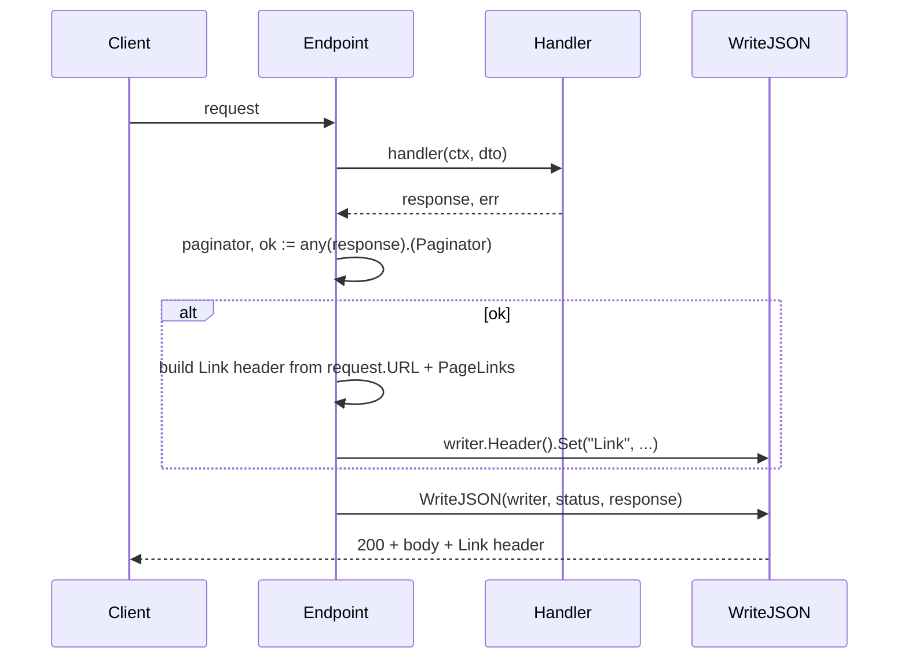

# RFC Compliance

*[Leia em português](rfc-compliance.pt-BR.md)*

How `arnon` relates to the relevant IETF standards for an HTTP
foundation: what is implemented, how it works, what is a deliberate
scope decision (and why), and what doesn't exist yet.
Last reviewed: 2026-07-15.

The goal is not "implement every RFC that exists," but to make
explicit, for each relevant one, whether `arnon` complies, partially
complies by deliberate decision, or doesn't implement it — and why
each case is or isn't a problem.

## Methodology

Each statement below was verified by reading the relevant source code
directly. Where the behavior depends on `net/http`/
`net/http.ServeMux` rather than `arnon` code, this was confirmed
empirically with minimal Go programs (not by assumption about what the
stdlib "should" do) — the results are noted where relevant.

## Summary

| RFC | Subject | Status |
|---|---|---|
| RFC 9457 | Problem Details for HTTP APIs | ✅ Single error format, across every middleware that produces an error |
| RFC 6901 | JSON Pointer | ✅ `ValidationSource.field` when `in: "body"`, with correct escaping, nested struct, array/slice index (`/items/0/name`), and map key (`/meta/x~1y`) |
| RFC 9110 | HTTP Semantics | ✅ HEAD/405/`OPTIONS`/content negotiation/multi-value headers |
| RFC 9111 | HTTP Caching | ✅ ETag + conditional GET via opt-in middleware |
| RFC 7239 | Forwarded HTTP Extension | ✅ Implemented in `RealIP`, with fallback to the de facto headers |
| RFC 6585 | Additional HTTP Status Codes | ✅ 429 with `Retry-After`; 431/428 out of the framework's reach (platform limit) |
| RFC 8288 / RFC 8631 | Web Linking / service link relations | ✅ `Link: rel="service-desc"` opt-in |
| RFC 8615 | Well-Known URIs | ❌ Out of scope |
| RFC 6749 / RFC 6750 / RFC 7617 | OAuth2 / Bearer / Basic | ❌ Deferred |
| RFC 8259 | JSON | ✅ Compliant |
| RFC 8949 | CBOR | ❌ Not implemented — design considered, see notes below |
| RFC 6902 / RFC 7386 | JSON Patch / JSON Merge Patch | ✅ `httpx/patch.From` derives `PATCH` from an existing `GET`+`PUT` pair |
| draft-ietf-httpapi-idempotency-key-header | Idempotency-Key (not yet an RFC) | ❌ Not implemented, worth tracking |

---

## RFC 9457 — Problem Details for HTTP APIs

The central RFC for `arnon` — it's the framework's only error format
(`CLAUDE.md`). Every HTTP error, from any middleware or from
`httpx.Endpoint`, becomes a `problem.Problem` serialized by
`httpx.WriteProblem` as `application/problem+json; charset=utf-8`.

* `type` is never set by default and is omitted from the JSON
  (`omitempty`) — per the RFC, which says the absence of `type` should
  be interpreted as `"about:blank"`. `Problem.WithType(...)` exists
  for anyone who wants dereferenceable error type URIs.
* `instance` is auto-populated by `httpx.WriteProblem` with
  `request.URL.Path` whenever it's empty (never overwriting a value
  set via `.WithInstance(...)`) — the pattern from the RFC's own
  non-normative example (`"/account/12345/msgs/abc"`). It doesn't use
  `request_id`/`trace_id` because `httpx` can't depend on
  `httpx/middleware`/`observability` in the dependency graph
  (`.go-arch-lint.yml`); anyone who wants a richer identifier calls
  `.WithInstance(...)` in their own `ProblemMapper`.
* `Recover()` logs the value of a recovered panic via
  `observability.LoggerFromContext` but never includes it in the
  response — it responds with `problem.NewInternal("")` (generic
  detail). RFC §3.1.5 is explicit that `detail` can carry sensitive
  information; a panic in Go frequently carries the exact value of a
  variable, a nil pointer dereference message, sometimes even file
  paths.
* `Timeout()` also responds with Problem Details (503) when the
  deadline expires — its own implementation (not stdlib's
  `http.TimeoutHandler`, which only knows how to respond in plain
  text), keeping the same buffering/deadline behavior as the stdlib.
  See details in the RFC 9111 section below about the buffering
  mechanism shared with `ETag`.
* `errors`/`source.field` as a validation extension follows the
  spirit of the RFC appendix's non-normative example (which uses
  `invalid-params`), with its own names — the RFC doesn't require
  specific names, just consistency.
* `source.field` uses **RFC 6901 (JSON Pointer)** when `source.in` is
  `"body"` — `/name`, `/address/city`, `/items/0/name`, `/tags/1`,
  `/meta/x~1y` (`problem.NewBodyError`). Special characters in the
  JSON field name (`~`, `/`) are escaped as `~0`/`~1` per RFC 6901 §3
  (`validation.escapeJSONPointerToken`) — without this, a field named
  `"a/b"` would become `/a/b`, indistinguishable from two segments.
  `validation.buildFieldMap` walks the request's actual *value* (not
  just the type — it needs to know the real size of a
  slice/array/map), recursing into nested structs (by value or
  pointer), slice/array elements (struct or primitive), and map
  entries with a string key (struct or primitive), composing the
  pointer level by level: `Address.City` → `/address/city`,
  `Items[2].Name` → `/items/2/name`, a primitive slice with `dive`
  (`Tags[1]`) → `/tags/1`, and a map entry with `dive`
  (`Meta["x/y"]`) → `/meta/x~1y` (the key, unlike the slice index,
  also goes through `escapeJSONPointerToken` — it can contain
  `~`/`/`). Both primitive slice and map need their own entry in the
  map for the index/key alone, since `validator/v10` reports the
  element's error without a field segment after them, not just
  recursion. Matching against the `validator/v10` error uses
  `FieldError.StructNamespace()` (the Go field name, not the `json`
  tag, with the root type name stripped — see
  `validation.structFieldNamespace`), whose format for a
  slice/map element (`Items[2].Name`, `Meta[x/y]` — raw key, no
  escaping, in the namespace; only the final pointer is escaped) was
  confirmed empirically before designing on top of it, not assumed.
  Limited to `maxFieldMapDepth` (16) levels of recursion (struct,
  index, and key all count toward the same limit), so it terminates
  even with a self-referential struct (e.g. a tree with `Parent
  *Node`) instead of recursing until the stack overflows. Since
  `buildFieldMap` now walks the real value (not just the type), the
  cost scales with the size of any slice/map reachable in the
  request — it only matters on the error path (`mapValidationErrors`
  only runs after `validator/v10` has already found at least one
  error), it doesn't affect a successful request. **Current
  limitation**: a non-string map key (`map[int]T`) falls back to the
  field name instead of becoming a segment — JSON only has string keys
  anyway (`encoding/json` already requires this, or `TextMarshaler`),
  so it's a rare case in a request DTO. RFC 6901 is its own RFC,
  separate from 9457, adopted because the body is the only
  hierarchical source among the four that `ValidationSource.in`
  covers; `path`/`query`/`header` have no nested structure, so
  `NewPathError`/`NewQueryError`/`NewHeaderError` use the raw field
  name, without pointer syntax.
* `problem.With` protects against collision with the default fields
  and empty keys (`ErrReservedExtensionKey`/`ErrEmptyExtensionKey`).
* The OpenAPI schema generated for `Problem`/`ValidationError`/`ValidationSource`
  (`openapi/problem.go`) marks more fields as `required` than the RFC
  demands — e.g. `title`/`status`/`detail` on `Problem`, even though
  the RFC treats all members as optional. This isn't an inconsistency:
  the schema documents the **actual contract that `arnon` always
  produces**, not the minimum the RFC permits — those are different
  things, and the decision here was deliberately made in favor of the
  former.

**Note**: if `json.Encode` fails inside `WriteProblem` (only
theoretically possible — the encoder already processed the same
`Problem` once), the fallback is `http.Error` (plain text), not a
hand-serialized `Problem`. Defensible (you can't trust an encoder that
just failed), but it's still a code path, practically impossible to
trigger in production, where the error format isn't the usual
`Problem`.

---

## RFC 9110 — HTTP Semantics

### HEAD and 405+`Allow`

`net/http.ServeMux` (Go 1.22+) already guarantees this on its own: a
`"GET /path"` pattern also matches `HEAD`, and the `net/http.Server`
connection layer suppresses the body and calculates `Content-Length`
correctly for `HEAD` automatically — below any `http.ResponseWriter`
that a middleware uses to wrap the response (confirmed empirically
with a real server: a middleware that buffers the entire response,
like `ETag`, still sees the full body on a `HEAD` request, with no
special handling). Requests to an unregistered method on an existing
path get `405` with `Allow` reflecting the actually registered
methods — also guaranteed by `ServeMux`, not by `arnon` code.

### `OPTIONS`

`CORS` (`httpx/middleware/cors.go`) only intercepts `OPTIONS` with
`204` when the request is a genuine preflight —
`Access-Control-Request-Method` present, the exact definition of a
"CORS-preflight request" in the Fetch spec §4.1. An `OPTIONS` without
that header (a generic client checking capabilities, RFC 9110 §9.3.7,
not a browser doing preflight) falls through to the `mux`: if the
path has no explicit `OPTIONS` handler, this results in `ServeMux`'s
real `405`+`Allow`; if it does, the explicit handler registered via
`Router.OPTIONS(...)` is reached.

### Content negotiation (`Accept`)

`httpx.Endpoint` only produces `application/json` — that's the
framework's central proposal (typed endpoint, validated against a
schema, documented in OpenAPI). This doesn't mean `arnon` ignores the
`Accept` header: `Endpoint` checks whether the client accepts
`application/json` before doing any binding, and responds `406 Not
Acceptable` (Problem Details) when `Accept` explicitly excludes that
type — for example `Accept: application/xml` alone, or
`Accept: application/json;q=0`. A missing, empty, or `Accept` that
includes `application/json`/`application/*`/`*/*` with q > 0 passes
normally (RFC 9110 §12.5.1: absence of `Accept` means "I accept
anything"). The implementation (`httpx/accept.go`) follows the RFC's
"most specific match wins" rule — an exact `application/json` entry
takes priority over `application/*`, which takes priority over `*/*`.

This resolves "never respond 406" without requiring the framework to
know how to serialize multiple representations of the same resource
(JSON vs. XML vs. whatever) — which would be a much bigger scope
change, likely working against the central proposal of a typed
endpoint with a single schema. See the "Formats besides JSON" section
below for how to serve XML, PDF, or any other content type/file within
the same `Router`.

### Formats besides JSON (XML, PDF, files, ...)

`httpx.Endpoint()` is JSON-only by design, but the `Router` isn't:
`Router.GET`/`POST`/etc. accept any `http.Handler`, not just what
`httpx.Endpoint` produces. A route that needs to return XML, PDF,
CSV, or any other content/file is a plain handler, mounted exactly
like any other:

```go
router.GET("/report.pdf", http.HandlerFunc(func(w http.ResponseWriter, r *http.Request) {
    w.Header().Set("Content-Type", "application/pdf")
    w.Write(pdfBytes)
}))
```

No framework middleware is coupled to JSON: `Compress` compresses any
allowed `Content-Type` (the default list already includes
`application/xml`, for example, and is configurable);
`ETag`/conditional GET works with any `Content-Type` (it only looks
at method and status, never the body itself beyond hashing the
bytes); `SecureHeaders`/`RateLimit`/`Throttle`/etc. make no assumption
about the response body. Verified with end-to-end tests
(`httpx/routing/router_test.go`:
`TestRouter_MountsArbitraryContentTypeHandlers`;
`httpx/middleware/etag_test.go`: `TestETag_WorksWithNonJSONContentTypes`).

### Header and query binding with multiple values

A `[]string` field with a `header:"X-Tags"` or `query:"tag"` tag
collects all values, not just the first. For header
(`httpx/binding/header.go`), this adds up values from multiple lines
of the same header (`Header.Values`) and also splits on commas within
a single line — RFC 9110 §5.3 treats both forms as semantically
equivalent (`X-Tags: a` + `X-Tags: b` is the same as
`X-Tags: a, b`), so the framework accepts both. For query
(`httpx/binding/query.go`), only key repetition (`?tag=a&tag=b`) is
collected — commas within a single query value aren't split, because
there's no RFC defining that semantics for query strings (unlike
header, where RFC 9110 is explicit) and splitting on commas
arbitrarily would break a legitimate search value like
`?q=cats,dogs`.

Scalar fields (`string`, `int`, `bool` in query; `string` in header)
keep working as always — the change is additive, only kicking in when
the field is `[]string`.

### Note — 422 vs. 400 for validation errors

`arnon` always uses `400` for binding/validation errors, except for
the explicit `StatusOverride` cases (e.g. `MaxBodyBytes` → 413). `422
Unprocessable Entity` (originating in RFC 4918/WebDAV, not RFC 9110,
but widely adopted outside WebDAV for "syntactically valid,
semantically invalid") already has a ready-made builder
(`problem.NewUnprocessableEntity`), it's just not the default.
Deliberate decision, defensible either way — mentioned here just for
the record that the tool exists.

---

## RFC 9111 — HTTP Caching

`ETag()` middleware (`httpx/middleware/etag.go`), opt-in — install it
wherever it makes sense, like any other middleware. Only acts on
`GET`/`HEAD` and only on `2xx` responses (redirects and Problem
Details pass through unchanged). Buffers the handler's entire
response (needs the full body to hash — unlike `Compress`, which
turns into streaming), calculates a strong ETag via FNV-1a 64-bit
(stdlib's `hash/fnv` — ETag is a change validator, not a security
token, doesn't need a cryptographic hash) over the exact body bytes,
and compares against `If-None-Match` using weak comparison (RFC 9110
§13.1.2: GET/HEAD must use weak comparison, so a `W/` prefix on either
side is ignored). On a match (or `If-None-Match: *`), responds `304`
with no body; otherwise, responds with the full body plus the `ETag`
header added. An `ETag` already set by the handler is respected
instead of recalculated.

Body suppression for `HEAD` and `Content-Length` calculation happen
at the `net/http.Server`'s own connection layer, below any middleware
`http.ResponseWriter` — so `ETag` works correctly for `HEAD` with no
special handling (confirmed with an end-to-end test using a real
`net/http.Server`).

Recommended order when combined with `Compress`: `ETag` before (more
external), to hash the already-compressed bytes — consistent with the
`Vary: Accept-Encoding` that `Compress` already sets, a cache ends up
with one validator per encoding. Combining with `NoCache` on the same
route defeats the purpose of both — not prevented by the code, just
documented.

`NoCache` (the negative side, forcing "never store in cache") and
`ETag` (the positive side, "store, but validate before reusing") are
complementary and independent tools; neither is the default, both are
opt-in per route/group.

---

## RFC 7239 — Forwarded HTTP Extension

`RealIP` (`httpx/middleware/real_ip.go`) resolves the client IP by
checking, in this order, with fallback when absent:

1. `Forwarded` (RFC 7239 — the IETF standard, formal replacement for
   the two headers below).
2. `X-Forwarded-For` (de facto, not standardized by any RFC) — only
   the first value of a comma-separated list is used (leftmost =
   original client, the convention of one value per proxy in the
   path).
3. `X-Real-IP` (de facto).
4. `request.RemoteAddr`.

The `Forwarded` parser (`parseForwardedFor`) extracts the `for=`
parameter from the first hop, handling: a plain value
(`for=192.0.2.60`), IPv6 with brackets and quotes
(`for="[2001:db8:cafe::17]:4711"`), multiple hops (only the first is
used), `for=unknown` (RFC 7239 §7.1 — the server doesn't know the
client's identity, falls through to the next header), and an
obfuscated identifier (RFC 7239 §6.3 — a `for=_hidden` isn't an IP,
but is kept as-is since it's a stable per-client token, still useful
as a rate-limit key). A quote-aware scanner (`splitTopLevel`) avoids
breaking on `,`/`;` inside quoted values.

`CanonicalizeIP` (used by `RateLimit`) reduces IPv6 addresses to the
`/64` prefix — an IPv6 client controls an entire `/64` via SLAAC, so
keying on the full address would let the client rotate addresses
within its own block to escape the limit.

---

## RFC 6585 — Additional HTTP Status Codes

* **429 Too Many Requests**: `RateLimit` uses `429` + `Retry-After`
  (in seconds, a valid form per RFC 9110 §10.2.3) + the
  `X-RateLimit-*` headers (these aren't standardized by any RFC,
  they're market convention).
* **431 Request Header Fields Too Large**: out of the framework's
  reach — when the header size limit is exceeded, it's
  `net/http.Server` (transport/parsing layer, via `MaxHeaderBytes`)
  that closes the connection before any `arnon` handler runs. There's
  no way to intercept this and respond with Problem Details without
  abandoning `net/http` as the foundation.
* **428 Precondition Required**: not implemented; it would make sense
  to revisit this together with an `If-Match` mechanism (out of scope
  for `ETag`, which only covers `If-None-Match` for safe methods),
  not in isolation.

---

## RFC 8288 (Web Linking) / RFC 8631 (service link relations)

`ServiceDesc(path string)` middleware
(`httpx/middleware/service_desc.go`), opt-in, adds
`Link: <path>; rel="service-desc"` (via `header.Add`, not `Set` —
adds to any other `Link` that already exists, e.g. from pagination,
instead of replacing them) on every response. A generic
client/tool that already understands `Link` headers discovers the
OpenAPI document (e.g. `/openapi.json`) without a hardcoded URL or
out-of-band documentation.

## RFC 8615 — Well-Known URIs

Out of scope. `/openapi.json` (or whatever path the user chooses) is
an arbitrary path, not a well-known endpoint under `/.well-known/`.
Not implemented — there's no concrete `/.well-known/` resource `arnon`
needs to serve today (e.g. `security.txt`, `openid-configuration`),
and the one discovery need the framework actually has (pointing a
client at the OpenAPI document) is already covered by `ServiceDesc`'s
`Link` header, which needs no well-known path at all.

Pagination via `Link` (`rel="next"`/`"prev"`, a convention popularized
by GitHub's API) also isn't implemented — there's currently no concept
of a paginated collection in `arnon` (endpoints return a single value,
not a collection), so there would be nowhere to plug this in yet.

If added, the contract most consistent with `arnon`'s existing
capability-detection pattern is an opt-in interface implemented by the
response type itself, not a change to `HandlerFunc`/`Endpoint`'s
signature:

```go
// PageLinks carries the query-parameter value for each pagination
// relation. An empty string omits that relation (e.g. no Prev on the
// first page, no Next on the last one).
type PageLinks struct {
    First string
    Prev  string
    Next  string
    Last  string
}

// Paginator is implemented by a response type that can describe its
// own pagination state. param names the query parameter carrying the
// page/cursor token (e.g. "cursor" or "page").
type Paginator interface {
    PageLinks() (param string, links PageLinks)
}
```

`Endpoint` would type-assert the handler's returned `TResponse` against
`Paginator` (`paginator, ok := any(response).(Paginator)`) right after
the handler call — the same capability-detection idiom `router.register`
already uses for `httpx.OpenAPIProvider`
(`provider, ok := handler.(httpx.OpenAPIProvider)`,
`httpx/routing/register_openapi.go`). For each non-empty relation it
would clone `request.URL`'s existing query values, overwrite `param`,
and build a relative reference (`path?query`, no host/scheme guessing
needed — RFC 8288 §3 allows a relative URI-reference in a `Link`
header, resolved against the request URI by the client; the same
reasoning that already keeps `WriteProblem`'s `Instance` field
host-agnostic). The combined value would be written with a single
`Header().Set("Link", ...)` call before `ServiceDesc`'s own
`Header().Add` runs, consistent with the coexistence note above.



Two alternatives were considered and set aside:

* **Extending `HandlerFunc`'s return tuple**
  (`func(ctx, req) (TResponse, PageInfo, error)`) — rejected: it
  changes the signature of every handler already written against it,
  paginated or not, for a capability only some endpoints need.
* **A parallel `PaginatedEndpoint`/`PaginatedHandlerFunc`
  constructor** — rejected: additive and non-breaking, but duplicates
  the whole bind → sanitize → validate → handle → respond pipeline in
  a second code path, so any future fix to `Endpoint` would need to
  land twice.

`openapi.Response.Headers` (`openapi/response.go`) already has the
field to document a `Link` header per operation
(`Headers: map[string]openapi.Header{"Link": {...}}`) — no framework
change would be needed there, since detecting "this operation is
paginated" isn't reliably knowable without running the handler.

---

## RFC 6749 / RFC 6750 / RFC 7617 — OAuth 2.0 / Bearer Token / Basic Auth

Not implemented — deferred decision. Bearer = RFC 6750, Basic =
RFC 7617 (not the obsolete RFC 2617).

---

## RFC 8259 — JSON

Compliant. `application/json; charset=utf-8` is universally accepted
even though the `charset` parameter is redundant for JSON (RFC 8259
§11 already assumes UTF-8 as the default) — not an error, just a
pedantic detail.

Side note (not an RFC matter, but adjacent): `encoding/json` by
default HTML-escapes `<`, `>`, and `&` in strings unless
`SetEscapeHTML(false)` is called. Valid behavior per RFC 8259 (any
character can become a `\uXXXX`), just surprising for anyone expecting
to see a literal `&` in an API's JSON response.

---

## RFC 8949 — CBOR (Concise Binary Object Representation)

Not implemented. `httpx.Endpoint` binds, validates, and serializes
exactly one representation per typed endpoint — JSON (RFC 8259) —
with no per-endpoint negotiation between wire formats, a deliberate
scope decision (`CLAUDE.md`, "`httpx.Endpoint` is JSON-only by
design"). Whoever needs CBOR (or XML, or anything else) mounts a
plain `http.Handler`, the same escape hatch as any other non-JSON
content (see `examples/cmd/files`) — but that means losing
`sanitize`/`validation`/OpenAPI generation for that representation,
since all three are only wired into `httpx.Endpoint`.

If multi-format negotiation is ever added, most of the pipeline
already doesn't care about wire format: `sanitize`/`validation`
operate on the bound Go value, not the request/response bytes, so
neither would need to change. Two things would: `httpx/binding` (which
only decodes JSON bodies today) and error responses — RFC 9457's
registered media type is `application/problem+json` specifically,
there is no standardized `application/problem+cbor`, so a CBOR client
would still need an explicit answer for how errors are represented.

Checked how huma handles this (`github.com/danielgtaylor/huma/v2/
formats/cbor`): CBOR is an opt-in subpackage that isolates its
`fxamacker/cbor/v2` dependency there, registered into the same
`huma.Format`/`Accept` negotiation JSON already uses — a workable
pattern if this is ever pursued here, following the same "external
dependency lives in its own opt-in piece, never in the `arnon` module
itself" shape as `RateLimit.LimitCounter`'s external-backend story.
fuego, for comparison, has no CBOR support either: its
`WithContentTypeSerDes` is a generic hook for a hand-written
serializer per content type, not a built-in format. No concrete demand
for this in `arnon` today.

---

## RFC 6902 (JSON Patch) / RFC 7386 (JSON Merge Patch)

Both are implemented, via `httpx/patch.From`. Both describe a wire
format for a *partial* update against a resource — a different shape
than `httpx.Endpoint`'s "one full-document representation, decoded
once" — so instead of teaching each `PATCH` handler to parse a patch
document, `From` derives one entirely from an existing `GET` and `PUT`
handler, by request replay: it calls `get` directly (never through a
`Router` — that would re-run global middleware a second time for the
synthetic request) to fetch the resource's current JSON, applies the
patch (RFC 7386 merge, or RFC 6902 operations, selected by the
incoming request's `Content-Type`) directly on the raw bytes via
`github.com/evanphx/json-patch/v5`, then calls `put` directly with the
merged body — reusing that handler's existing
binding/sanitize/validation entirely unchanged. Neither `get` nor
`put` needs to know `PATCH` exists.

This sidesteps a real Go limitation, confirmed empirically: a plain
struct field can't distinguish "omitted" from "explicit null" —
`json.Unmarshal` into a `*string` produces `nil` for both `{}` and
`{"name":null}`. RFC 7386 needs that distinction (omitted = leave
alone, `null` = delete), so decoding a merge-patch body straight into
a typed struct can't express it without a custom tri-state type.
Operating on raw JSON bytes before ever touching the typed struct
avoids the problem entirely — the same reason RFC 6902 fits this shape
too: the patch document (an operation list) isn't shaped like the
resource at all, so it was never going to decode into a typed struct
in the first place.

`From` deliberately does not auto-discover the `GET`/`PUT` pair for a
path the way huma's `autopatch.AutoPatch(api)` does:
`openapi.Generator`/`Registry` is write-only (`Register`/
`RegisterTypes`, no lookup) and only tracks endpoints that opted into
OpenAPI, so repurposing it as a functional routing registry would be a
layering violation. `From(get, put, config)` takes both handlers
explicitly instead — no new introspection API anywhere, matching the
framework's existing "explicit over magic" pattern (`ChainConfig.Extra`
over auto-ordering, `CORS` not intercepting every `OPTIONS`).

Known, accepted limitation: the internal `GET`→apply→`PUT` sequence
has a lost-update race under concurrent `PATCH`es to the same
resource, since `arnon` has no `If-Match`/optimistic-concurrency
mechanism yet (see the 428/`If-Match` note above). `From` still copies
the internal `GET` response's `ETag`/`Last-Modified` onto the internal
`PUT`'s `If-Match`/`If-Unmodified-Since` (mirroring huma) — inert
today, since nothing checks those headers on `PUT` yet, but means
`From` won't need rework once that mechanism exists.

fuego has neither RFC, nor anything resembling `autopatch`.

---

## draft-ietf-httpapi-idempotency-key-header — Idempotency-Key

Not yet an RFC (confirmed: it's at version -07 as an Internet-Draft
of the IETF HTTPAPI working group, with no RFC number assigned) —
mentioned here just as something to track. If/when it becomes an RFC,
it's a natural fit for `arnon`: the `Idempotency-Key` header exists
precisely to make `POST`/`PATCH` retry-tolerant, and the framework
already has `RateLimit`/`MaxBodyBytes` as precedent for a "middleware
with pluggable storage" (`LimitCounter`) — the same pattern would
serve as a model for an analogous "IdempotencyStore."

---

## What's not implemented yet

Genuine future work, outside the scope already covered above:

* Pluggable storage adapters for `RateLimit` (Redis, Valkey, Memcached
  — the `LimitCounter` interface is already ready for it).
* Bearer/Basic Auth (deferred).
* `/.well-known/` (RFC 8615) and pagination via `Link` — no concrete
  demand today, see notes above.
* `428 Precondition Required` / `If-Match` — would only make sense
  alongside a broader precondition mechanism than what `ETag`
  currently covers.
* CBOR (RFC 8949) / multi-format negotiation for `httpx.Endpoint` — no
  concrete demand today, see notes above.
* Track `Idempotency-Key` (still a draft, not an RFC).
