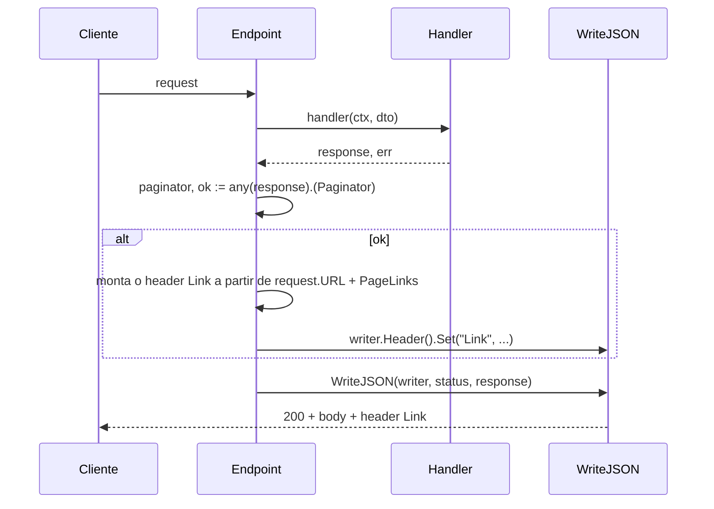

# Conformidade com RFCs

*[Read in English](rfc-compliance.md)*

Como o `arnon` se relaciona com os padrões IETF relevantes para uma
fundação HTTP: o que é implementado, como funciona, o que é uma
decisão deliberada de escopo (e por quê) e o que ainda não existe.
Última revisão: 2026-07-29.

O objetivo não é "implementar toda RFC que existe", mas deixar
explícito, para cada uma relevante, se o `arnon` atende, atende
parcialmente por decisão deliberada, ou não implementa — e por que
cada caso é ou não um problema.

## Metodologia

Cada afirmação abaixo foi verificada lendo o código-fonte relevante
diretamente. Onde o comportamento depende de `net/http`/
`net/http.ServeMux` em vez de código do `arnon`, isso foi confirmado
empiricamente com programas Go mínimos (não por suposição sobre o que
a stdlib "deveria" fazer) — os resultados estão anotados onde
relevante.

## Resumo

| RFC | Assunto | Situação |
| --- | --- | --- |
| RFC 9457 | Problem Details for HTTP APIs | ✅ Formato único de erro, em toda middleware que produz erro |
| RFC 6901 | JSON Pointer | ✅ `ValidationSource.field` quando `in: "body"`, com escaping correto, struct aninhado, índice de array/slice (`/items/0/name`) e chave de map (`/meta/x~1y`) |
| RFC 9110 | HTTP Semantics | ✅ HEAD/405/`OPTIONS`/negociação de conteúdo/multi-valor de header |
| RFC 9111 | HTTP Caching | ✅ ETag + conditional GET via middleware opt-in |
| RFC 9110 §13.1.1/§13.1.4 | Preconditions de escrita (If-Match / If-Unmodified-Since) | ✅ `httpx/precondition.Check`/`CheckRequest`, `428` opt-in |
| RFC 7239 | Forwarded HTTP Extension | ✅ Implementado em `RealIP`, com fallback pros headers de fato |
| RFC 6585 | Additional HTTP Status Codes | ✅ 429 com `Retry-After`, 428 opt-in; 431 fora do alcance do framework (limite de plataforma) |
| RFC 8288 / RFC 8631 | Web Linking / service link relations | ✅ `Link: rel="service-desc"` opt-in |
| RFC 8615 | Well-Known URIs | ❌ Fora de escopo |
| RFC 6749 / RFC 6750 / RFC 7617 | OAuth2 / Bearer / Basic | ❌ Adiado |
| RFC 8259 | JSON | ✅ Conforme |
| RFC 8949 | CBOR | ❌ Não implementado — design considerado, ver notas abaixo |
| RFC 6902 / RFC 7386 | JSON Patch / JSON Merge Patch | ✅ `httpx/patch.From` deriva `PATCH` a partir de um par `GET`+`PUT` já existente |
| draft-ietf-httpapi-idempotency-key-header | Idempotency-Key (ainda não é RFC) | ❌ Não implementado, vale acompanhar |

---

## RFC 9457 — Problem Details for HTTP APIs

RFC central pro `arnon` — é o único formato de erro do framework
(`CLAUDE.md`). Todo erro HTTP, de qualquer middleware ou do
`httpx.Endpoint`, vira um `problem.Problem` serializado por
`httpx.WriteProblem` como `application/problem+json; charset=utf-8`.

* `type` nunca é setado por padrão e é omitido do JSON (`omitempty`) —
  conforme a RFC, que diz para interpretar a ausência de `type` como
  `"about:blank"`. `Problem.WithType(...)` existe pra quem quiser URIs
  de tipo de erro dereferenciáveis.
* `instance` é auto-populado por `httpx.WriteProblem` com
  `request.URL.Path` sempre que estiver vazio (nunca sobrescrevendo um
  valor setado via `.WithInstance(...)`) — o padrão do próprio exemplo
  não-normativo da RFC (`"/account/12345/msgs/abc"`). Não usa
  `request_id`/`trace_id` porque `httpx` não pode depender de
  `httpx/middleware`/`observability` no grafo de dependências
  (`.go-arch-lint.yml`); quem quiser um identificador mais rico chama
  `.WithInstance(...)` no próprio `ProblemMapper`.
* `Recover()` loga o valor de um panic recuperado via
  `observability.LoggerFromContext` mas nunca o inclui na resposta —
  responde com `problem.NewInternal("")` (detail genérico). A RFC
  §3.1.5 é explícita sobre `detail` poder carregar informação
  sensível; um panic em Go frequentemente carrega o valor exato de
  uma variável, uma mensagem de nil pointer dereference, às vezes até
  paths de arquivo.
* `Timeout()` também responde com Problem Details (503) quando o
  prazo estoura — implementação própria (não usa
  `http.TimeoutHandler` da stdlib, que só sabe responder em texto
  puro), mantendo o mesmo comportamento de buffering/deadline da
  stdlib. Ver detalhes na seção RFC 9111 mais abaixo sobre o
  mecanismo de buffering compartilhado com `ETag`.
* `errors`/`source.field` como extensão de validação segue o espírito
  do exemplo não-normativo do apêndice da RFC (que usa
  `invalid-params`), com nomes próprios — a RFC não exige nomes
  específicos, só consistência.
* `source.field` usa **RFC 6901 (JSON Pointer)** quando `source.in` é
  `"body"` — `/name`, `/address/city`, `/items/0/name`, `/tags/1`,
  `/meta/x~1y` (`problem.NewBodyError`). Caracteres especiais no nome
  do campo JSON (`~`, `/`) são escapados como `~0`/`~1` conforme RFC
  6901 §3 (`validation.escapeJSONPointerToken`) — sem isso, um campo
  chamado `"a/b"` viraria `/a/b`, indistinguível de dois segmentos.
  `validation.buildFieldMap` caminha pelo *valor* real da request
  (não só o tipo — precisa saber o tamanho de verdade de um
  slice/array/map), recursando em struct aninhado (por valor ou
  ponteiro), elemento de slice/array (struct ou primitivo) e entrada
  de map com chave string (struct ou primitivo), compondo o pointer
  nível a nível: `Address.City` → `/address/city`, `Items[2].Name` →
  `/items/2/name`, um slice de primitivo com `dive` (`Tags[1]`) →
  `/tags/1`, e uma entrada de map com `dive` (`Meta["x/y"]`) →
  `/meta/x~1y` (a chave, diferente do índice de slice, também passa
  por `escapeJSONPointerToken` — pode conter `~`/`/`). Tanto slice
  quanto map de primitivo precisam de entrada própria no mapa pro
  índice/chave sozinho, já que o `validator/v10` reporta erro de
  elemento sem segmento de campo depois deles, não só recursão. O
  cruzamento com o erro do `validator/v10` usa
  `FieldError.StructNamespace()` (nome de campo Go, não a tag `json`,
  com o nome do tipo raiz removido — ver
  `validation.structFieldNamespace`), cujo formato pra elemento de
  slice/map (`Items[2].Name`, `Meta[x/y]` — chave crua, sem escaping,
  no namespace; só o pointer final é escapado) foi confirmado
  empiricamente antes de desenhar em cima dele, não assumido. Limitado
  a `maxFieldMapDepth` (16) níveis de recursão (struct, índice e chave
  contam pro mesmo limite), pra terminar mesmo com um struct
  auto-referente (ex. árvore com `Parent *Node`) em vez de recursar até
  estourar a pilha. Como `buildFieldMap` agora caminha o valor de
  verdade (não só o tipo), o custo escala com o tamanho de qualquer
  slice/map alcançável na request — só importa no caminho de erro
  (`mapValidationErrors` só roda depois que o `validator/v10` já
  encontrou pelo menos um erro), não afeta request bem-sucedida.
  **Limite atual**: chave de map não-string (`map[int]T`) cai no
  fallback de nome de campo em vez de virar segmento — JSON só tem
  chave string de qualquer forma (`encoding/json` já exige isso, ou
  `TextMarshaler`), então é um caso raro em DTO de request. RFC 6901 é
  uma RFC própria, à parte da
  9457, adotada porque o corpo é a única fonte hierárquica entre as
  quatro que `ValidationSource.in` cobre; `path`/`query`/`header` não
  têm estrutura aninhada, então
  `NewPathError`/`NewQueryError`/`NewHeaderError` usam o nome cru do
  campo, sem sintaxe de pointer.
* `problem.With` protege contra colisão com os campos padrão e chave
  vazia (`ErrReservedExtensionKey`/`ErrEmptyExtensionKey`).
* O schema OpenAPI gerado pra `Problem`/`ValidationError`/`ValidationSource`
  (`openapi/problem.go`) marca como `required` mais campos do que a RFC
  exige — ex. `title`/`status`/`detail` em `Problem`, embora a RFC trate
  todos os membros como opcionais. Não é inconsistência: o schema
  documenta o **contrato real que o `arnon` sempre produz**, não o mínimo
  permitido pela RFC — são coisas diferentes, e a decisão aqui foi
  deliberada em favor do primeiro.

**Nota**: se `json.Encode` falhar dentro de `WriteProblem` (só
teoricamente possível — o encoder já processou o mesmo `Problem` uma
vez), o fallback é `http.Error` (texto puro), não um `Problem`
serializado à mão. Defensável (não dá pra confiar no encoder que
acabou de falhar), mas ainda é um caminho, praticamente impossível de
disparar em produção, onde o formato de erro não é o `Problem` usual.

---

## RFC 9110 — HTTP Semantics

### HEAD e 405+`Allow`

`net/http.ServeMux` (Go 1.22+) já garante isso sozinho: um padrão
`"GET /caminho"` também casa `HEAD`, e a camada de conexão do
`net/http.Server` suprime o corpo e calcula o `Content-Length`
corretamente pra `HEAD` automaticamente — abaixo de qualquer
`http.ResponseWriter` que uma middleware use pra empacotar a resposta
(confirmado empiricamente com um servidor real: um middleware que
bufferiza a resposta inteira, como `ETag`, ainda vê o corpo completo
numa request `HEAD`, sem tratamento especial). Requisições pra um
método não registrado num path existente recebem `405` com `Allow`
refletindo os métodos de fato registrados — também garantido pelo
`ServeMux`, não por código do `arnon`.

### `OPTIONS`

`CORS` (`httpx/middleware/cors.go`) só intercepta `OPTIONS` com `204`
quando a requisição é um preflight de verdade — `Access-Control-Request-Method`
presente, a definição exata de "CORS-preflight request" na Fetch spec
§4.1. Um `OPTIONS` sem esse header (um cliente genérico checando
capacidades, RFC 9110 §9.3.7, não um browser fazendo preflight) cai
pro `mux`: se o path não tiver handler `OPTIONS` explícito, isso
resulta no `405`+`Allow` real do `ServeMux`; se tiver, o handler
explícito registrado via `Router.OPTIONS(...)` é alcançado.

### Negociação de conteúdo (`Accept`)

`httpx.Endpoint` só produz `application/json` — é a proposta central
do framework (endpoint tipado, validado contra um schema, documentado
em OpenAPI). Isso não significa que o `arnon` ignore o header
`Accept`: `Endpoint` checa se o cliente aceita `application/json`
antes de fazer qualquer binding, e responde `406 Not Acceptable`
(Problem Details) quando o `Accept` explicitamente exclui esse tipo —
por exemplo `Accept: application/xml` sozinho, ou
`Accept: application/json;q=0`. Um `Accept` ausente, vazio, ou que
inclua `application/json`/`application/*`/`*/*` com q > 0 passa
normalmente (RFC 9110 §12.5.1: ausência de `Accept` significa "aceito
qualquer coisa"). A implementação (`httpx/accept.go`) segue a regra
de "match mais específico decide" da RFC — uma entrada exata
`application/json` tem prioridade sobre `application/*`, que tem
prioridade sobre `*/*`.

Isso resolve o "não responde 406 nunca" sem exigir que o framework
saiba serializar múltiplas representações do mesmo recurso (JSON vs.
XML vs. o que for) — que seria uma mudança de escopo bem maior,
provavelmente indo contra a proposta central de endpoint tipado com
schema único. Ver a seção "Formatos além de JSON" abaixo pra como
servir XML, PDF, ou qualquer outro tipo de conteúdo/arquivo dentro do
mesmo `Router`.

### Formatos além de JSON (XML, PDF, arquivos, ...)

`httpx.Endpoint()` é JSON-only por design, mas o `Router` não é:
`Router.GET`/`POST`/etc. aceitam qualquer `http.Handler`, não só o
que `httpx.Endpoint` produz. Uma rota que precisa devolver XML, PDF,
CSV, ou qualquer outro conteúdo/arquivo é um handler comum, montado
exatamente como qualquer outra:

```go
router.GET("/report.pdf", http.HandlerFunc(func(w http.ResponseWriter, r *http.Request) {
    w.Header().Set("Content-Type", "application/pdf")
    w.Write(pdfBytes)
}))
```

Nenhuma middleware do framework é acoplada a JSON: `Compress`
comprime qualquer `Content-Type` permitido (a lista default já inclui
`application/xml`, por exemplo, e é configurável);
`ETag`/conditional GET funciona em qualquer `Content-Type` (só olha
método e status, nunca o corpo em si além de hashear os bytes);
`SecureHeaders`/`RateLimit`/`Throttle`/etc. não fazem suposição
nenhuma sobre o corpo da resposta. Verificado com testes de ponta a
ponta (`httpx/routing/router_test.go`:
`TestRouter_MountsArbitraryContentTypeHandlers`;
`httpx/middleware/etag_test.go`: `TestETag_WorksWithNonJSONContentTypes`).

### Binding de header e query com múltiplos valores

Um campo `[]string` com tag `header:"X-Tags"` ou `query:"tag"` coleta
todos os valores, não só o primeiro. Pra header
(`httpx/binding/header.go`), isso soma valores de múltiplas linhas do
mesmo header (`Header.Values`) e também faz split por vírgula dentro
de uma única linha — RFC 9110 §5.3 trata as duas formas como
semanticamente equivalentes (`X-Tags: a` + `X-Tags: b` é o mesmo que
`X-Tags: a, b`), então o framework aceita as duas. Pra query
(`httpx/binding/query.go`), só a repetição de chave (`?tag=a&tag=b`)
é coletada — comas dentro de um valor de query não são separados,
porque não existe uma RFC definindo essa semântica pra query strings
(diferente de header, onde a RFC 9110 é explícita) e separar por
vírgula arbitrariamente quebraria um valor de busca legítimo como
`?q=cats,dogs`.

Campos escalares (`string`, `int`, `bool` em query; `string` em
header) continuam funcionando como sempre — a mudança é aditiva, só
ativa quando o campo é `[]string`.

### Nota — 422 vs. 400 pra erros de validação

`arnon` sempre usa `400` pra erro de binding/validação, exceto os
`StatusOverride` explícitos (ex. `MaxBodyBytes` → 413). `422
Unprocessable Entity` (originado na RFC 4918/WebDAV, não na RFC 9110,
mas amplamente adotado fora de WebDAV pra "sintaticamente válido,
semanticamente inválido") já tem um builder pronto
(`problem.NewUnprocessableEntity`), só não é o default. Decisão
deliberada, defensável dos dois jeitos — citada aqui só pra constar
que a ferramenta existe.

---

## RFC 9111 — HTTP Caching

Middleware `ETag()` (`httpx/middleware/etag.go`), opt-in — instale
onde fizer sentido, como qualquer outra middleware. Só atua em
`GET`/`HEAD` e só em respostas `2xx` (redirects e Problem Details
passam inalterados). Bufferiza a resposta inteira do handler (precisa
do corpo completo pra hashear — diferente do `Compress`, que
transforma em streaming), calcula um ETag forte via FNV-1a 64-bit
(`hash/fnv` da stdlib — ETag é validador de mudança, não token de
segurança, não precisa de hash criptográfico) sobre os bytes exatos
do corpo, e compara contra `If-None-Match` usando comparação fraca
(RFC 9110 §13.1.2: GET/HEAD devem usar comparação fraca, então um
prefixo `W/` de qualquer lado é ignorado). Em caso de match (ou
`If-None-Match: *`), responde `304` sem corpo; senão, responde o
corpo completo com o header `ETag` adicionado. Um `ETag` já setado
pelo handler é respeitado em vez de recalculado.

A supressão de corpo pra `HEAD` e o cálculo de `Content-Length`
acontecem na camada de conexão do próprio `net/http.Server`, abaixo
de qualquer `http.ResponseWriter` de middleware — então `ETag`
funciona correto pra `HEAD` sem tratamento especial (confirmado com
um teste de ponta a ponta usando um `net/http.Server` de verdade).

Ordem recomendada quando combinado com `Compress`: `ETag` antes (mais
externo), pra hashear os bytes já comprimidos — consistente com o
`Vary: Accept-Encoding` que o `Compress` já seta, um cache acaba com
um validador por encoding. Combinar com `NoCache` na mesma rota anula
o propósito dos dois — não impedido pelo código, só documentado.

`NoCache` (o lado negativo, forçar "nunca guardar em cache") e `ETag`
(o lado positivo, "guarde, mas valide antes de reusar") são
ferramentas complementares e independentes; nenhuma é o default,
ambas são opt-in por rota/grupo.

---

## RFC 9110 §13.1.1 / §13.1.4 — Preconditions de Escrita (If-Match / If-Unmodified-Since)

`httpx/precondition.Check`/`CheckRequest`, com `Config{Require bool}`
(opt-in pro `428`, ver a seção RFC 6585 abaixo). Essa é a contraparte
do lado de escrita do GET condicional do `ETag` acima, e é
arquiteturalmente diferente por um motivo: o `ETag` consegue calcular
tudo que precisa a partir da resposta que já está bufferizando, mas
uma precondition de escrita precisa ser checada contra o estado
*atual* do recurso no momento da escrita — algo que só o código que
carrega esse recurso (pra aplicar um `PUT`/`PATCH`/`DELETE`) realmente
sabe. Então, diferente do `ETag`, isso não é middleware; é uma função
que o próprio handler chama, passando seu próprio `etag`/
`lastModified` já conhecido. Confirmado contra o próprio pacote
`danielgtaylor/huma/v2/conditional` do huma antes de implementar isso:
o `PreconditionFailed(etag, modified)` dele também é chamado pelo
handler, não computado pelo framework, pelo mesmo motivo.

`If-Match` usa comparação forte (RFC 9110 §13.1.1): um `ETag` fraco
(`W/"..."`) de qualquer lado nunca satisfaz, diferente da própria
comparação fraca do `ETag` pro `If-None-Match` acima (RFC 9110 §13.1.2
exige comparação fraca ali, já que `GET`/`HEAD` são métodos seguros).
`*` dá match em qualquer recurso existente. `If-Unmodified-Since` só é
avaliado quando `If-Match` está ausente (RFC 9110 §13.1.4: um servidor
DEVE ignorar `If-Unmodified-Since` quando `If-Match` está presente) —
uma data não parseável ou um `lastModified` não setado são tratados
como não verificáveis, e a requisição segue em frente em vez de ser
rejeitada.

O `httpx/patch.From` (seção RFC 6902/7386 abaixo) usa isso
diretamente: antes de aplicar um patch, ele checa o `If-Match`/
`If-Unmodified-Since` da própria requisição `PATCH` recebida contra o
`ETag`/`Last-Modified` do `GET` interno via `CheckRequest`, rejeitando
com `412` antes de sequer chamar o handler `PUT` subjacente se não
baterem.

O fuego não tem nada parecido (confirmado: nenhum guia sobre ETag,
requisição condicional, ou concorrência otimista em nenhum lugar da
documentação dele).

---

## RFC 7239 — Forwarded HTTP Extension

`RealIP` (`httpx/middleware/real_ip.go`) resolve o IP do cliente
checando, nesta ordem, com fallback quando ausente:

1. `Forwarded` (RFC 7239 — o padrão IETF, substituto formal dos dois
   headers abaixo).
2. `X-Forwarded-For` (de fato, não normatizado por nenhuma RFC) — só
   o primeiro valor de uma lista separada por vírgula é usado
   (leftmost = cliente original, convenção de um valor por proxy no
   caminho).
3. `X-Real-IP` (de fato).
4. `request.RemoteAddr`.

O parser de `Forwarded` (`parseForwardedFor`) extrai o parâmetro
`for=` do primeiro hop, lidando com: valor simples
(`for=192.0.2.60`), IPv6 com colchetes e aspas
(`for="[2001:db8:cafe::17]:4711"`), múltiplos hops (só o primeiro é
usado), `for=unknown` (RFC 7239 §7.1 — servidor não sabe a identidade
do cliente, cai pro próximo header) e identificador ofuscado (RFC
7239 §6.3 — um `for=_hidden` não é IP, mas é mantido como está por
ser um token estável por cliente, ainda útil como chave de rate
limit). Um scanner ciente de aspas (`splitTopLevel`) evita quebrar em
`,`/`;` dentro de valores entre aspas.

`CanonicalizeIP` (usado por `RateLimit`) reduz endereços IPv6 ao
prefixo `/64` — um cliente IPv6 controla um `/64` inteiro via SLAAC,
então chavear pelo endereço completo deixaria o cliente rotacionar
endereço dentro do próprio bloco pra escapar do limite.

---

## RFC 6585 — Additional HTTP Status Codes

* **429 Too Many Requests**: `RateLimit` usa `429` + `Retry-After` (em
  segundos, forma válida pela RFC 9110 §10.2.3) + os headers
  `X-RateLimit-*` (esses não são normatizados por RFC nenhuma, são
  convenção de mercado).
* **431 Request Header Fields Too Large**: fora do alcance do
  framework — quando o limite de tamanho de header é excedido, é o
  `net/http.Server` (nível de transporte/parsing, via
  `MaxHeaderBytes`) que fecha a conexão antes de qualquer handler do
  `arnon` rodar. Não dá pra interceptar isso e responder com Problem
  Details sem abandonar `net/http` como base.
* **428 Precondition Required**: `httpx/precondition.Config{Require:
  true}` — opt-in, já que a maioria das APIs não quer que toda escrita
  exija uma precondition. Lançado junto com o próprio mecanismo de
  `If-Match`/`If-Unmodified-Since` (seção RFC 9110 §13.1.1/§13.1.4
  acima), não isoladamente, como planejado.

---

## RFC 8288 (Web Linking) / RFC 8631 (service link relations)

Middleware `ServiceDesc(path string)`
(`httpx/middleware/service_desc.go`), opt-in, adiciona
`Link: <path>; rel="service-desc"` (via `header.Add`, não `Set` —
soma a outros `Link` que já existam, ex. de paginação, em vez de
substituí-los) em toda resposta. Um cliente/ferramenta genérico que
já entende `Link` headers descobre o documento OpenAPI (ex.
`/openapi.json`) sem URL hardcoded ou documentação fora de banda.

## RFC 8615 — Well-Known URIs

Fora de escopo. `/openapi.json` (ou o path que o usuário escolher) é
um path arbitrário, não um endpoint bem-conhecido em `/.well-known/`.
Não implementado — não existe hoje nenhum recurso `/.well-known/`
concreto que o `arnon` precise servir (ex.: `security.txt`,
`openid-configuration`), e a única necessidade de descoberta que o
framework realmente tem (apontar o cliente pro documento OpenAPI) já é
coberta pelo header `Link` do `ServiceDesc`, que não precisa de path
bem-conhecido nenhum.

Paginação via `Link` (`rel="next"`/`"prev"`, convenção popularizada
pela API do GitHub) também não está implementada — não há hoje
nenhum conceito de coleção paginada em `arnon` (endpoints retornam um
valor único, não uma coleção), então não haveria onde plugar isso
ainda.

Se vier a ser implementada, o contrato mais consistente com o padrão
de detecção de capacidade que `arnon` já usa é uma interface opt-in
implementada pelo próprio tipo de resposta, não uma mudança na
assinatura de `HandlerFunc`/`Endpoint`:

```go
// PageLinks carrega o valor do parâmetro de query para cada relação
// de paginação. Uma string vazia omite essa relação (ex.: sem Prev na
// primeira página, sem Next na última).
type PageLinks struct {
    First string
    Prev  string
    Next  string
    Last  string
}

// Paginator é implementada por um tipo de resposta capaz de descrever
// seu próprio estado de paginação. param nomeia o parâmetro de query
// que carrega o token de página/cursor (ex.: "cursor" ou "page").
type Paginator interface {
    PageLinks() (param string, links PageLinks)
}
```

`Endpoint` faria um type assertion do `TResponse` retornado pelo
handler contra `Paginator` (`paginator, ok :=
any(response).(Paginator)`) logo após a chamada ao handler — o mesmo
idioma de detecção de capacidade que `router.register` já usa para
`httpx.OpenAPIProvider` (`provider, ok :=
handler.(httpx.OpenAPIProvider)`, `httpx/routing/register_openapi.go`).
Para cada relação não vazia, clonaria os valores de query já existentes
em `request.URL`, sobrescreveria `param`, e montaria uma referência
relativa (`path?query`, sem precisar adivinhar host/scheme — a RFC 8288
§3 permite uma referência de URI relativa em um header `Link`,
resolvida contra a URI da requisição pelo cliente; o mesmo raciocínio
que já mantém o campo `Instance` de `WriteProblem` agnóstico a host).
O valor combinado seria escrito com uma única chamada
`Header().Set("Link", ...)`, antes do `Header().Add` do próprio
`ServiceDesc` rodar — consistente com a nota de coexistência acima.



Duas alternativas foram consideradas e descartadas:

* **Estender a tupla de retorno de `HandlerFunc`**
  (`func(ctx, req) (TResponse, PageInfo, error)`) — descartada: muda a
  assinatura de todo handler já escrito contra ela, paginado ou não,
  por uma capacidade que só alguns endpoints precisam.
* **Um construtor paralelo `PaginatedEndpoint`/`PaginatedHandlerFunc`**
  — descartado: aditivo e sem quebra, mas duplica todo o pipeline
  bind → sanitize → validate → handle → respond em um segundo caminho
  de código, então qualquer correção futura em `Endpoint` precisaria
  ser aplicada duas vezes.

`openapi.Response.Headers` (`openapi/response.go`) já tem o campo para
documentar um header `Link` por operação
(`Headers: map[string]openapi.Header{"Link": {...}}`) — nenhuma
mudança no framework seria necessária ali, já que detectar "esta
operação é paginada" não é algo confiável de saber sem rodar o
handler.

---

## RFC 6749 / RFC 6750 / RFC 7617 — OAuth 2.0 / Bearer Token / Basic Auth

Não implementado — decisão adiada. Bearer = RFC 6750, Basic = RFC 7617
(não a RFC 2617 obsoleta).

---

## RFC 8259 — JSON

Conforme. `application/json; charset=utf-8` é aceito universalmente
mesmo que o parâmetro `charset` seja redundante pra JSON (a RFC 8259
§11 já assume UTF-8 como default) — não é um erro, só um detalhe
pedante.

Nota à parte (não é questão de RFC, mas adjacente): `encoding/json`
por padrão HTML-escapa `<`, `>` e `&` em strings a menos que
`SetEscapeHTML(false)` seja chamado. Comportamento válido pela
RFC 8259 (qualquer caractere pode virar um `\uXXXX`), só surpreendente
pra quem espera ver `&` literal numa resposta JSON de API.

---

## RFC 8949 — CBOR (Concise Binary Object Representation)

Não implementado. `httpx.Endpoint` faz bind, valida e serializa
exatamente uma representação por endpoint tipado — JSON (RFC 8259) —
sem negociação entre formatos de wire por endpoint, uma decisão de
escopo deliberada (`CLAUDE.md`, "`httpx.Endpoint` é JSON-only por
design"). Quem precisar de CBOR (ou XML, ou qualquer outra coisa)
monta um `http.Handler` puro, o mesmo escape hatch de qualquer outro
conteúdo não-JSON (ver `examples/cmd/files`) — mas isso significa
perder `sanitize`/`validation`/geração de OpenAPI pra essa
representação, já que os três só estão conectados no `httpx.Endpoint`.

Se negociação multi-formato for adicionada algum dia, boa parte do
pipeline já não se importa com o formato de wire: `sanitize`/
`validation` operam sobre o valor Go já vinculado, não sobre os bytes
da requisição/resposta, então nenhum dos dois precisaria mudar. Duas
coisas precisariam: `httpx/binding` (que hoje só decodifica corpo
JSON) e as respostas de erro — o media type registrado da RFC 9457 é
especificamente `application/problem+json`, não existe um
`application/problem+cbor` padronizado, então um cliente CBOR ainda
precisaria de uma resposta explícita pra como os erros são
representados.

Verifiquei como o huma trata isso
(`github.com/danielgtaylor/huma/v2/formats/cbor`): CBOR é um
subpacote opt-in que isola sua dependência `fxamacker/cbor/v2` ali,
registrado na mesma negociação `huma.Format`/`Accept` que o JSON já
usa — um padrão viável se isso for perseguido aqui algum dia, seguindo
a mesma forma "dependência externa vive numa peça própria opt-in,
nunca no módulo `arnon` em si" que já existe na história de backend
externo do `RateLimit.LimitCounter`. O fuego, pra comparação, também
não tem suporte a CBOR: seu `WithContentTypeSerDes` é um hook genérico
pra serializer escrito à mão por content type, não um formato de
fábrica. Sem demanda concreta pra isso no `arnon` hoje.

---

## RFC 6902 (JSON Patch) / RFC 7386 (JSON Merge Patch)

As duas estão implementadas, via `httpx/patch.From`. As duas descrevem
um formato de wire pra uma atualização *parcial* de um recurso — um
formato diferente do "uma representação completa do documento,
decodificada uma vez" do `httpx.Endpoint` — então em vez de ensinar
cada handler `PATCH` a parsear um documento de patch, o `From` deriva
um inteiramente a partir de um handler `GET` e `PUT` já existentes,
via replay de requisição: ele chama `get` direto (nunca através de um
`Router` — isso rodaria a middleware global de novo pra requisição
sintética) pra buscar o JSON atual do recurso, aplica o patch (merge
da RFC 7386, ou operações da RFC 6902, escolhido pelo `Content-Type`
da requisição recebida) direto nos bytes crus via
`github.com/evanphx/json-patch/v5`, e então chama `put` direto com o
corpo já mesclado — reaproveitando o binding/sanitização/validação já
existentes desse handler sem nenhuma mudança. Nem `get` nem `put`
precisam saber que `PATCH` existe.

Isso contorna uma limitação real do Go, confirmada empiricamente: um
campo de struct comum não distingue "ausente" de "`null` explícito" —
`json.Unmarshal` num `*string` produz `nil` tanto pra `{}` quanto pra
`{"name":null}`. A RFC 7386 precisa dessa distinção (ausente = não
mexe, `null` = apaga), então decodificar um corpo de merge-patch direto
num struct tipado não consegue expressar isso sem um tipo tri-state
customizado. Operar nos bytes JSON crus antes de tocar no struct
tipado evita o problema por completo — o mesmo motivo pelo qual a RFC
6902 se encaixa nesse formato também: o documento de patch (uma lista
de operações) não tem o formato do recurso de jeito nenhum, então
nunca ia decodificar num struct tipado de qualquer forma.

O `From` deliberadamente não descobre automaticamente o par `GET`/
`PUT` de um path do jeito que o `autopatch.AutoPatch(api)` do huma
faz: `openapi.Generator`/`Registry` é write-only (`Register`/
`RegisterTypes`, sem lookup) e só rastreia endpoints que optaram por
OpenAPI, então reaproveitá-lo como registro funcional de rotas seria
uma violação de camadas. `From(get, put, config)` recebe os dois
handlers explicitamente em vez disso — nenhuma API de introspecção
nova em lugar nenhum, seguindo o padrão já existente de "explícito em
vez de mágico" do framework (`ChainConfig.Extra` em vez de
auto-ordenação, `CORS` não interceptando todo `OPTIONS`).

O `From` checa o `If-Match`/`If-Unmodified-Since` da própria requisição
`PATCH` recebida (`httpx/precondition.CheckRequest`, seção RFC 9110
§13.1.1/§13.1.4 acima) contra o `ETag`/`Last-Modified` do `GET`
interno antes de aplicar o patch, rejeitando com `412` antes do `put`
ser chamado se não baterem — isso é o que realmente protege a intenção
de concorrência otimista de um cliente (mandar o `ETag` que ele leu
antes). O `From` também continua copiando o `ETag`/`Last-Modified` da
resposta do `GET` interno pro `If-Match`/`If-Unmodified-Since` do
`PUT` interno (espelhando o huma), mas isso só fecha a race mais
estreita entre o `GET` e o `PUT` internos (um segundo escritor
intrometendo-se entre os dois, dentro da mesma chamada de `PATCH`) se
o handler `put` subjacente também chamar `precondition.Check`/
`CheckRequest` com seu próprio estado atual lido atomicamente — o
`From` não tem como fazer essa parte por ele, já que não tem noção do
que "estado atual" significa pra um recurso arbitrário.

O fuego não tem nenhuma das duas RFCs, nem nada parecido com
`autopatch`.

---

## draft-ietf-httpapi-idempotency-key-header — Idempotency-Key

Ainda não é uma RFC (confirmado: está na versão -07 como
Internet-Draft do grupo de trabalho HTTPAPI da IETF, sem número de
RFC atribuído) — citado aqui só como algo a acompanhar. Se/quando
virar RFC, é um encaixe natural pro `arnon`: o header
`Idempotency-Key` existe exatamente pra tornar `POST`/`PATCH`
tolerantes a retry, e o framework já tem `RateLimit`/`MaxBodyBytes`
como precedente de "middleware com storage plugável"
(`LimitCounter`) — o mesmo padrão serviria de modelo pra um
"IdempotencyStore" análogo.

---

## O que ainda não está implementado

Trabalho futuro genuíno, fora do escopo já coberto acima:

* Adaptadores de storage plugável pra `RateLimit` (Redis, Valkey,
  Memcached — interface `LimitCounter` já pronta pra isso).
* Bearer/Basic Auth (adiado).
* `/.well-known/` (RFC 8615) e paginação via `Link` — sem demanda
  concreta hoje, ver notas acima.
* CBOR (RFC 8949) / negociação multi-formato pro `httpx.Endpoint` —
  sem demanda concreta hoje, ver notas acima.
* Acompanhar o `Idempotency-Key` (ainda draft, não RFC).
